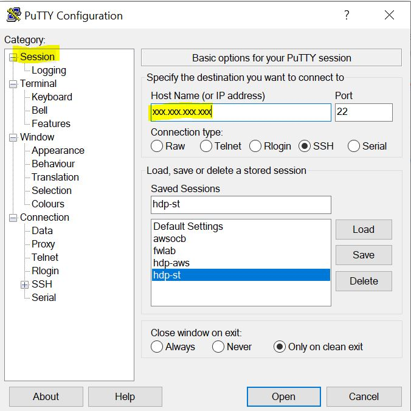

# Hadoop y Map Reduce. Práctica 1
**José Incera, Abril, 2020**

## Objetivo

+  Reafirmar conceptos básicos de la arquitectura Hadoop y el modelo de programación MapReduce.
+	Mostrar el uso de la API Hadoop Streaming para lanzar funciones *Map* y *Reduce* en lenguajes de programación distintos de Java.

### Entregables

La fecha de entrega es el **Viernes 24 de abril** a las 15:00.  Se entregan:

+ Los scripts de los ejercicios
+ Un  reporte con **los resultados obtenidos** y, donde lo considere adecuado, **capturas de pantalla**.

## Introducción

Usted puede desplegar una instancia de Hadoop en prácticamente cualquier proveedor de servicios en la nube (Amazon AWS, Google Cloud, Windows Azure, ...), instalarlo localmente en una máquina virtual en su computadora o crear su propio cluster.

En el ITAM contamos con una sala de cómputo con instancias individuales de Hadoop que se pueden agrupar en clusters.  Sin embargo, debido a las restricciones por la contingencia sanitaria, solamente podremos acceder a un pequeño servidor donde se ha configurado un ambiente básico de Hadoop. 

Cada alumno tiene una cuenta en ese servidor. Su identificador es su apellido y los últimos dos dígitos de su clave única.  Por ejemplo, mi identificador es incera77.   Durante le sesión se le indicará cuál es la contraseña.  **Por favor cambie la contraseña con el comando `passwd`** cuando entre por primera vez al sistema.

Se accede al servidor a través del protocolo `SSH` (Secure shell).  Si tiene Windows 10 con el subsistema Ubuntu (WSL) o una computadora MAC, puede invocar la conexión desde una ventana de comandos así (sustituya las xxx por la dirección que se le indique)x:

``` bash
$ ssh jincera@xxx.xxx.xxx.xxx
```

Si está utilizando Windows, necesitará descargar el programa `PuTty` desde esta dirección: [https://putty.org/](https://putty.org/).

Una vez instalada, lance la aplicación `PuTTY`, de clic en `Session` y ponga la dirección IP del servidor  Para no repetir este paso, puede guardar esta configuración en la sección `Saved Sessions`.

)

De clic en `Open`. Se le solicitará un nombre de usuario y la contraseña.

### Preparación de carpetas en HDFS

Si es la preimra vez que ingresa, debe tener un directorio en el sistema de archivos de Hadoop. Para ello, ejecute lo siguiente (sustituya \<usuario\> por su nombre de usuario):

```bash 
$ hdfs dfs -mkdir -p /user/<usuario>
$ hdfs dfs -ls /user
Found 1 items
drwxr-xr-x   - <usuario> supergroup          0 2019-05-14 16:15 /user/<usuario>
```

## Desarrollo

En un escenario electoral hipotético, se realizaron encuestas de salida para conocer las preferencias de los electores, así como algunos datos demográficos.  De estas encuestas se generó el archivo *votacion.csv* el cual contiene cuatro campos:

1. Hora.- Número entero en el rango [8:17], registra la hora en que se aplicó la encuesta al elector
2. Género.- H = Hombre, M = Mujer, se trata del género del elector
3. Distrito.- Un código que representa el distrito electoral en el que se aplicó la encuesta
4. Candidato.- Número entero en el rango [1:5], representa cada uno de los cinco candidatos que se postularon.

Aunque el archivo *votacion.csv* es muy pequeño, en esta práctica se almacenará en una instancia de Hadoop en su máquina virtual y se realizarán algunos análisis básicos con el modelo MapReduce utilizando guiones (scripts) en Python.

Esta práctica también permitirá experimentar con algunos comandos básicos de Unix/Linux.

### Preparación de datos

En esta práctica trabajaremos exclusivamente a través de la interfaz de la línea de comandos (CLI). Si no lo ha hecho, conéctese a la máquina virtual de su ambiente Hadoop.  

**1.-** En su directorio `$HOME` cree la carpeta `Hdp-Pr1` con dos subcarpetas: `code` y `data`.

```bash
$ cd
$ mkdir -p Hdp-Pr1/code
$ mkdir -p Hdp-Pr1/data
$ ls -l Hdp-Pr1
total 8
drxwr-xr-x 2 root root 4096 may 21 18:40 code
drxwr-xr-x 2 root root 4096 may 21 18:40 data
```

**2.-** Descargue los archivos *EjMapper.py* y *EjReducer.py* y guárdelos en la carpeta `code` creada anteriormente.  De la misma forma, descargue el archivo *votacion.csv* y guárdelo en la carpeta `data`.

```bash
$ cd Hdp-Pr1/code
$ wget https://raw.githubusercontent.com/jincera/Test-Repo/master/EjMapper.py
$ wget https://raw.githubusercontent.com/jincera/Test-Repo/master/EjReducer.py
$ ls
EjMapper.py  EjReducer.py

$ cd ../data
$ wget https://raw.githubusercontent.com/jincera/Test-Repo/master/votacion.csv
$ ls
votacion.csv
```

**3.-** Ubique el archivo *votacion.csv*  y despliegue las primeras líneas.

```bash
$ head -3 votacion.csv
12,M,1048,CAND5
15,H,7932,CAND1
13,H,7373,CAND4
```
Como puede observar, se trata de un archivo csv en el que los campos están separados por comas y no tiene encabezado.

Los archivos se encuentran en el sistema de archivos local.  Hay que enviarlos a HDFS, el sistema de archivos distribuido de Hadoop:

```bash
$ hdfs dfs -put votacion.csv
$ hdfs dfs -ls
...
-rw-r--r-- 1 root hds 1591000 2017-05-21 18:59 votacion.csv
...
```

El comando *hdfs dfs* (o el equivalente *hadoop fs* en la versión anterior) indica a Linux que se introducirá una directiva para el sistema de archivos HDFS.  Los argumentos siguientes son la directiva y posibles parámetros.  Consulte la presentación de la primera sesión del curso para conocer algunos comandos de HDFS.

Es una buena práctica probar los scripts de Map y Reduce con un conjunto pequeño de datos y, dentro de lo posible, paso a paso desde la línea de comandos, aprovechando los *pipes* de Linux. 

**4.-** Prepare un archivo de prueba con los primeros 100 registros

```bash
$ head -100 votacion.csv > vottst.csv
```

### Programación de scripts

En esta sesión se desarrollarán los scripts con el lenguaje de programación Python. Al ser un lenguaje interpretado, será muy sencillo verificar el comportamiento de los programas map y reduce con pipes de Linux.

Empezaremos por calcular las preferencias electorales para cada uno de los candidatos.

Los archivos *EjMapper.py* y *EjReducer.py* en la carpeta `code`,  son ejemplos de un código mapper y de un reducer, respectivamente.  El primero lee registros desde la entrada estándar (*stdin*, típicamente el teclado), selecciona dos campos y los imprime en la salida estándar (*stdout*, típicamente la pantalla).  Estos dos campos son la tupla *< key,value >* que el reducer tomará para continuar con el procesamiento.

Haga una copia de los archivos `EjMapper.py` y `EjReducer.py` como respaldo en caso de que algo salga mal durante la ejecución de la práctica

```bash
$ cp EjMapper.py EjMapper.py.bak
$ cp EjReducer.py EjReducer.py.bak
```

**5.-** Edite el archivo *EjMapper.py*. Revise el código y modifique la última línea para que se imprima en stdout la columna correspondiente al candidato (key) y un "1" (value). El código del reducer simplemente sumará estas instancias.  

**6.-** Posiciónese en la carpeta *code* y revise los permisos de los archivos *EjMapper.py* y  *EjReducer.py*

```bash
$ cd ~/Hdp-Pr1/code 
$ ls -l
total 8
-rw-r--r-- 1 root root 422 may 21 18:44 EjMapper.py
-rw-r--r-- 1 root root 819 may 21 18:45 EjReducer.py
```
Para Linux estos archivos no contienen código ejecutable; sólo tienen permisos de lectura y escritura (rw-).  Modifique los permisos para que también puedan ser ejecutados:

```bash
$ chmod 764 *py
$ ls -l
total 8
-rwxrw-r- 1 root root 422 may 21 18:44 EjMapper.py
-rwxrw-r- 1 root root 819 may 21 18:45 EjReducer.py
```
El comando anterior otorga permisos de lectura, escritura y ejecución (7) al dueño, lectura y escritura (6) a los miembros del grupo y sólo lectura (4) a los demás usuarios.

**7.-** Con ayuda del encadenamiento de comandos (pipelining) en Linux, verifique que el código parece funcionar correctamente.

```bash
$ cat ../data/vottst.csv |./EjMapper.py
...
CAND5	1
CAND4	1
CAND4	1
```

El comando *cat* lee y despliega en pantalla el archivo.  El "pipe" (|) toma esa salida y la pasa al siguiente comando, nuestro script *EjMapper.py*, como su propia entrada estándar.

**8.-** Abra el archivo *EjReducer.py* y analice su contenido.

Este archivo tiene un acumulador para contar el número de ocurrencias de un operador.  Dado que a un proceso *Reduce* llegan los datos ordenados, solo hay que incrementar el acumulador mientras el campo operador (key) no cambie.  En principio, este código no debe ser modificado.

**9.-** Nuevamente usaremos los pipes de Linux, para verificar que el Reducer parece hacer su función.  El comando *sort* en la siguiente instrucción ordena la salida de nuestro mapper, imitando la operación *shuffle* de MapReduce en Hadoop.  La salida del sort se toma como entrada para el script *EjReducer.py*.

```bash
$ cat ../data/vottst.csv | ./EjMapper.py | sort | ./EjReducer.py
CAND1	8
CAND2	5
CAND3	17
CAND4	48
CAND5	22
```

### Ejecución en Hadoop
Ahora que todo parece funcionar correctamente, se puede enviar el código para ser  ejecutado en Hadoop.  Dado que los programas están escritos en Python, se requiere de la API *hadoop streaming*, la cual permite lanzar tareas MapReduce escritas en prácticamente cualquier lenguaje capaz de recibir datos de la entrada estándar y de escribir resultados en la salida estándar.

**10.-**	Desde la terminal, ejecute el siguiente comando:

```bash
$ hadoop jar /usr/local/hadoop/share/hadoop/tools/lib/hadoop-streaming-2.7.7.jar -input votacion.csv -output OpElec -mapper EjMapper.py -reducer EjReducer.py

$ hdfs dfs -ls OpElec

Found 2 items
-rw-r--r--   1 ubuntu supergroup          0 2018-04-28 23:49 05/_SUCCESS
-rw-r--r--   1 ubuntu supergroup         64 2018-04-28 23:49 05/part-00000

$ hdfs dfs -cat 0pElec/part-00000
CAND1   10056
CAND2   9884
CAND3   15051
CAND4   40018
CAND5   24991
```
Los argumentos de la instrucción anterior son:

- input: El archivo de donde se leerán los datos que se envían a los procesos Map
- output: El directorio donde se almacenan los resultados (o los mensajes de error)
- mapper, reducer: Los scripts con los códigos para los procesos Map y Reduce

Como vamos a estar utilizando frecuentemente esta API, quizás le gustaría crear una variable de ambiente con la ruta del archivo jar para simplificar la escritura del comando:

```bash
$ export STRJAR=/usr/local/hadoop/share/hadoop/tools/lib/hadoop-streaming-2.7.7.jar  
```
De esta manera, el comando anterior se invocaría así:

```bash
$ hadoop jar $STRJAR -files EjMapper.py, ...
```
Revise brevemente la salida, compruebe que no hubo errores, identifique cuántas tareas map y reduce se dispararon.

**11.-** Verifique que el resultado se generó correctamente:

```bash
$ hadoop fs -cat OpcionElectoral/part-00000
1	10056
2	9884
3	15051
4	40018
5	24991
```

Así se nombran los archivos de salida en la primera versión de MapReduce. En la versión más reciente se nombran part-[m|r]-xxxxx para indicar si el archivo se generó a la salida de un Mapper (m) o de un Reducer (r).  El número (xxxxx) es un identificador único en esa carpeta para distinguir entre los resultados de (potencialmente) muchas tareas.

Ahora lance el job con la API de Hadoop streaming y el archivo votación.  **Aprovecharemos para mostrar cómo se invoca la ejecución de varias tareas Reducer, lo que puede ser útil para procesar grandes volúmenes de datos**.

Observe que estamos especificando un nuevo directorio de salida.  Hadoop no permite reescribir archivos.

```bash
$ hadoop jar $STRJAR -input votacion.csv -output OpElect3  
-mapper EjMapper.py -reducer EjReducer.py -numReduceTasks 2
```

Verifique que obtuvo los mismos resultados, solo que en dos archivos de salida:

```bash
$ hdfs dfs -ls OpElec3
-rw-r--r--  1 ubuntu supergroup   0 2017-05-21  22:48 OpElec3/_SUCCESS
-rw-r--r--  1 ubuntu supergroup   0 2017-05-21  22:48 OpElec3/part-00000
-rw-r--r--  1 ubuntu supergroup   0 2017-05-21  22:48 OpElec3/part-00001

$ hdfs dfs -cat OpElec3/part-00000
CAND1  10056
CAND3  15051
CAND5  24991

$ hdfs dfs -cat OpElec3/part-00001
CAND2  9884
CAND4  40018
```

El ambiente decidió por sí mismo cómo distribuir las llaves entre los dos Reducers. De lo que podemos tener certeza, es que todos los registros con la misma llave, llegaron al mismo Reducer.

### 2.4 Hadoop streaming con varios lenguajes

Como habrá observado, los scripts proporcionados en Python reportan el número de votos que obtuvo cada candidato.   El código mapper simplemente lee líneas de la entrada estándar, separa los campos y envía a la salida estándar una línea con el candidato y un valor "1".   Hagamos lo mismo en un script de `shell bash`.

**12.-** Escriba el siguiente script de bash. Guárdelo como `miMapper.sh` en la subcarpeta `code`.

```bash
#!/bin/bash
awk -F , '{print $4,"\t","1"}'
```

Asigne permisos de ejecución al script 

**14.**	Antes de invocar Hadoop streaming, probemos con los pipes de unix (con el mapper que haya implementado)

```bash
$ cat ../data/vottst.csv|./miMapper.sh | sort -n|./EjReducer.py

CAND1    8
CAND2    5
CAND3    17
CAND4    48
CAND5    22
```

**15.-** Ahora lance el job con la API de Hadoop streaming y el archivo votación.  

```bash
$ hadoop jar $STRJAR -input votacion.csv -output OpElec5  
-mapper miMapper.sh -reducer EjReducer.py

$ hdfs dfs -cat OpElec5/part-00000
CAND1    10056
CAND2    9884
CAND3    15051
CAND4    40018
CAND5    24991
```

​	
 **¡Felicidades!  Ahora puede escribir programas MapReduce en Java, R o Python!** 

## Ejercicios

Ahora que se ha familiarizado con el entorno Hadoop y con el despliegue de aplicaciones en distintos lenguajes de programación, desarrolle los códigos necesarios para responder a las siguientes preguntas.

Puede escribir los programas en el lenguaje de su elección. Debe entregar el código y los resultados obtenidos.

I.	¿Cuántos distritos electorales contiene el archivo votacion.csv?

II.	¿Cuántas encuestas se obtuvieron por distrito electoral? ¿En qué distrito se capturaron más encuestas? ¿En cuál menos?

III. ¿Cuántos votos obtuvo cada candidato en cada distrito electoral? ¿Cuántos obtuvo el candidato 1 en el distrito 1232? ¿Cuántos el candidato 5 en el distrito 9184?

IV. ¿Cómo se distribuyó el voto por género para cada candidato en cada distrito electoral? ¿En qué distrito y para qué candidato se obtuvo la menor preferencia electoral de los varones?

V.	Calcule el histograma de votación por hora para todo el proceso electoral.

