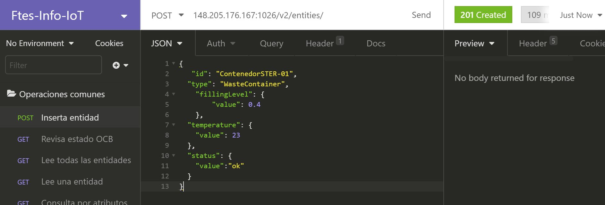
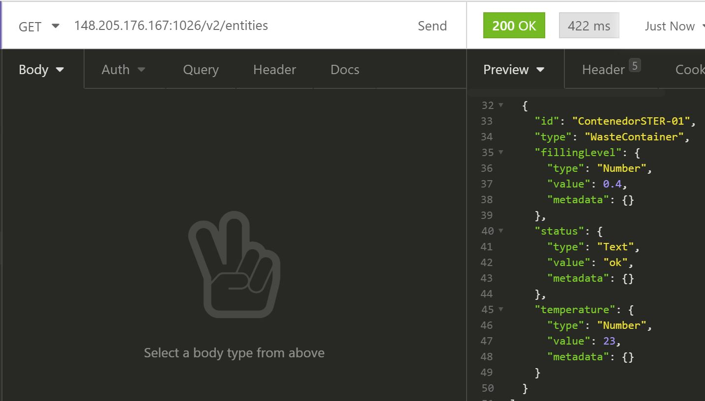
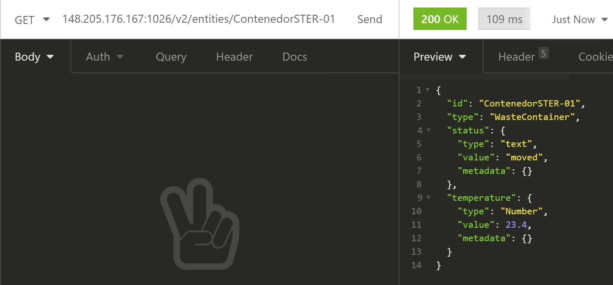
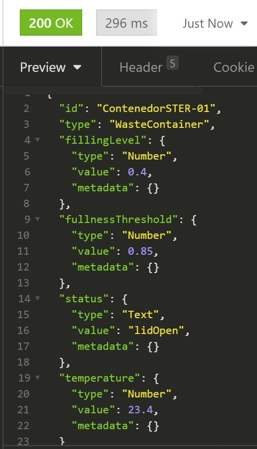
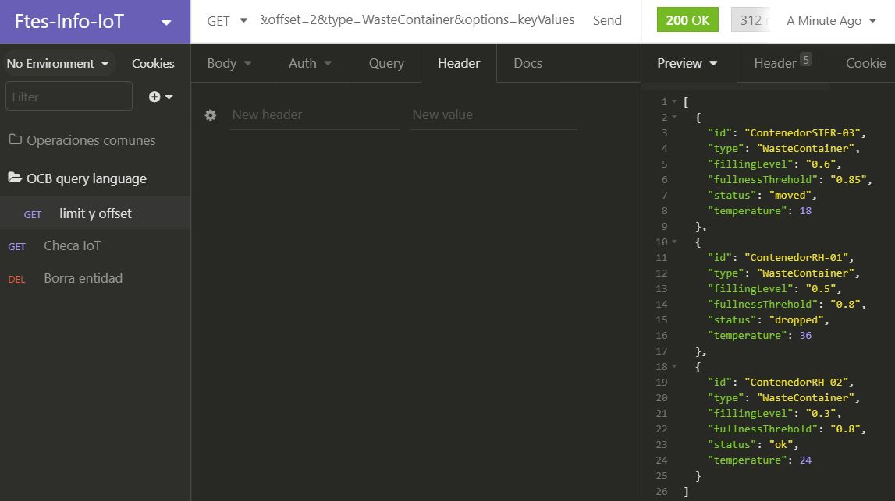
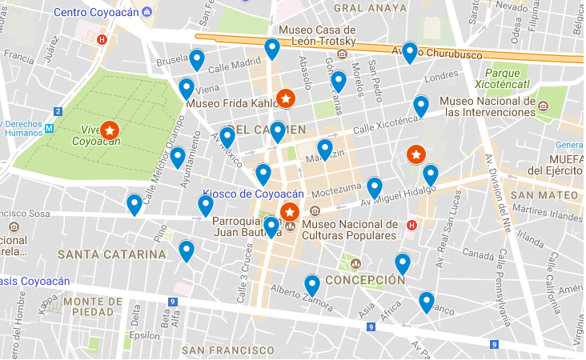
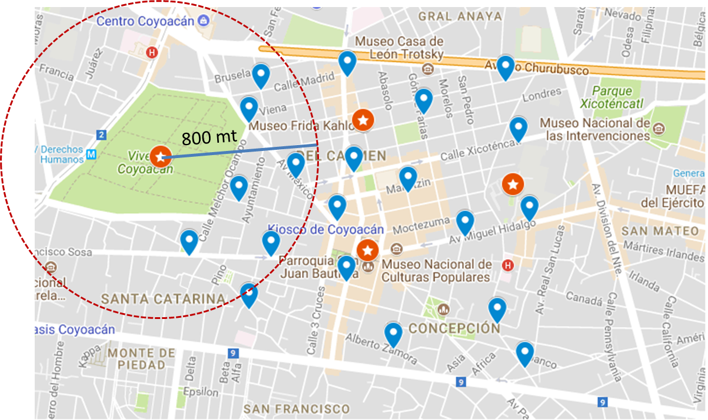
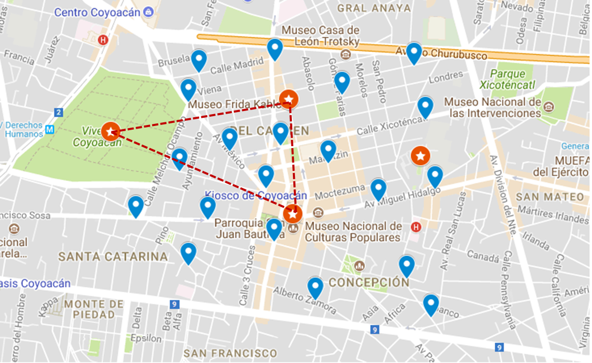

# Fuentes de Información

## Práctica 4: Introducción a Fiware-Orion Context Broker

### Introducción

En la presentación que se ha hecho como introducción a esta serie de prácticas, hemos conversado sobre el impacto profundo que la Internet de las Cosas (IoT, *Internet of Things*) tendrá en prácticamente todas las actividades de nuestra vida.  

Hemos puesto la atención en las muchas aplicaciones que se han desplegado en el sector salud, desde las pulseras y bandas para medir signos vitales, hasta monitores de partículas peligrosas en zonas hospitalarias.

También hemos mencionado que, para sacar provecho de lo que los objetos *inteligentes* perciben, es necesario contar con una plataforma que permita capturar, procesar, mostrar y almacenar los datos capturados por esos objetos.

En esta parte del curso nos daremos una idea básica del flujo de datos típico al implementar aplicaciones inteligentes que utilicen información obtenida de diferentes medios como sensores, usuarios de dispositivos móviles, etcétera. 

### 1. Objetivos

En esta práctica tendremos una primera exposición a **Fiware**, una plataforma abierta que permite desplegar aplicaciones *inteligentes* muy rápidamente.  Específicamente, estaremos interactuando con su componente central, el **Orion Context Broker** (OCB), que es el encargado de recibir los datos enviados por los objetos de interés.

Los objetivos particulares son:

* Familiarizarse con el entorno de Fiware, específicamente con el GE Orion Context Broker (OCB)
* Conocer la interfaz y el modelo de datos utilizado por Fiware
* Utilizar comandos RESTful para interactuar con el OCB
  

### 2. Material

* [Insomnia](https://insomnia.rest/),o cualquier cliente REST, como la herramienta [Postman](https://www.getpostman.com/).
* Para el desarrollo de la práctica se utilizará un ambiente instalado en un servidor del laboratorio. Si lo desea, puede descargar un contenedor docker con el OCB e instalarlo en su computadora personal siguiendo las instrucciones de las ligas que se incluyen al final de este documento. 
  También puede instalar su servidor en la nube experimental Fiware Lab Cloud. Las instrucciones se proporcionan al final de este documento.

### 3. Instrucciones

* La práctica se hace por binomios
* Tiempo de entrega: Una semana (21 de mayo)
* Se entrega un reporte con las capturas de pantalla de los ejercicios y preguntas planteadas a lo largo del tutorial
  

### 4. Desarrollo

En Fiware, para que las aplicaciones puedan obtener información de los sensores y objetos inteligentes, un componente esencial es el Orion Context Broker (OCB). Orion Context Broker es una implementación de la API NGSI (*Next Generation Service Interface*) que permite manejar y asegurar la disponibilidad de la información obtenida del contexto donde se encuentra el objeto (el sensor). La versión que se utiliza actualmente es **NGSIv2**.

La especificación completa de NGSIv2 se encuentra aquí: [http://fiware.github.io/context.Orion/api/v2/stable/](http://fiware.github.io/context.Orion/api/v2/stable/).


La interacción típica en la plataforma Fiware (como en la mayoría de las plataformas para Internet de las Cosas) consta de tres elementos: el productor de información de contexto (por ejemplo, un sensor), un intermediario, que en nuestro caso es el OCB, y el consumidor de esa información.


El productor de información de contexto se encargará de crear nuevas entidades o de actualizar las entidades ya existentes. Típicamente accede al OCB a través del **puerto 1026**.

Los últimos datos se mantienen persistentes en el OCB con ayuda de una base de datos; en nuestro caso, se utiliza MongoDB.

El OCB funciona como intermediario entre los productores de información y otros componentes (los consumidores de información) como pueden ser un tablero de mando para representar gráficamente la información, un conector hacia bases de datos o repositorios de big data, un procesador en tiempo real, etcétera.

En este tutorial vamos a interactuar con el OCB enviando y consultando representaciones de objetos a través de una API REST.

### Representación de datos de contexto

Para representar objetos de la vida real se utiliza el modelo de entidades de la API NGSI. En éste se define un **modelo de datos** de información de contexto basado en *entidades* y en *atributos*. Cada entidad representa un objeto de la vida real y puede tener atributos y metadatos.

Las entidades cuentan con un identificador (ID) y un tipo. **Esta pareja ID/tipo debe ser única en el OCB**.  Los atributos y metadatos se representan por una tupla **[nombre, tipo, valor]**. 

Todos los datos estarán representados con el formato JSON (también podrían representarse en otro formato, por ejemplo, key/value). El formato de datos **JSON (Java Script Object Notation)** es ligero para el intercambio de información, además de ser fácil de leer, así como de procesar.

Un Objeto JSON tiene las siguiente forma:


Es decir, se encuentran definidos entre llaves. *String* será definido como las propiedades entidades. Los *value* son los atributos.

Por ejemplo, modelaremos la temperatura y nivel de carga de un contenedor de basura con la siguiente entidad

```java
{
   "id": "ContenedorSTER-01",
	"type": "WasteContainer",
    "dateLastEmptying": {
        "type": "DateTime",
        "value": "2019-09-21T15:05:59.408Z"
    },
    "fillingLevel": {
        "value": 0.4
    },
    "fullnessThreshold": {
        "value": 0,85
    },
	"temperature": {
	   "type": "Number",
		"value": 23,
		"metadata":{
            “precision”: {
				“type”:"Integer",
  				“value”:4
			}
		}
	},
    "status"; "lidOpen",
    "address": {
    "@type": "PostalAddress",
    "addressLocality": "Mexico Beach",
    "addressRegion": "FL",
    "streetAddress": "3102 Highway 98"
  },
}
```

Como se observa en el ejemplo anterior, en los atributos se puede especificar o no el tipo de dato. Se recomienda especificarlo siempre; si se omite, el OCB tratará de inferirlo.  

También se observa que la metadata es opcional y en caso de exisitir, su formato será también una tupla [nombre, tipo, valor].

*Nota:* Fiware ya tiene un conjunto de modelos estandarizados. Pueden consultarse en la página [https://www.fiware.org/data-models/](https://www.fiware.org/data-models/). Otra página de interés es [http://schema.org/](http://schema.org/).

Si se encuentra un modelo del objeto que deseamos representar, conviene utilizar esos esquemas para que nuestro producto sea interoperable.


### 5. Interactuando con el OCB

(Los tutoriales para empezar a trabajar con Fiware se encuentran en: [https://fiware-tutorials.readthedocs.io/en/latest/](https://fiware-tutorials.readthedocs.io/en/latest/). Esta práctica está inspirado en algunos de esos tutoriales).

Tenemos varias opciones para trabajar con los componentes de Fiware:

1. Instalándolos localmente en máquinas virtuales con ayuda de contenedores.  
2. Instalándolos en un servidor local.
3. Instalándolos en un servidor en la nube (por ejemplo en AWS)
4. Accediendo a instancias de los componentes en el ambiente de desarrollo Fiware Lab Cloud.  Puede solicitar una cuenta de prueba en esta liga: [https://fiware-training.readthedocs.io/es_MX/latest/ecosistemaFIWARE/FIWARELab/](https://fiware-training.readthedocs.io/es_MX/latest/ecosistemaFIWARE/FIWARELab/).  **Así trabajaremos en esta práctica.  Nuestro servidor se encuentra en la dirección 207.249.127.101**.
   

#### 5.1 Introducción

El OCB contiene una interfaz tipo Web para realizar las consultas a la base de datos MongoDB. Se trata de un servicio web de tipo REST (Representational state transfer). 

En esta práctica, la interacción con el OCB se hará a través de la herramienta [Insomnia](https://insomnia.rest/). Si lo desea, puede utilizar cualquier otro cliente REST, como la popular herramienta `Postman`  De hecho, se puede hacer desde la terminal de git con el comando *curl*, pero ello es mucho más propenso a errores.

El URL con el que estaremos interactuando es `http://xxx.xxx.xxx.xxx:1026/v2/...`.  (*Si trabaja con el servidor que se habilitó para esta práctica, la IP es 207.249.127.101*). El servidor espera peticiones en el puerto 1026 y estamos utilizando la versión 2 de la NGSI.

Vamos a empezar por verificar que el sevidor está activo utilizando el comando GET, escribiendo el URL directamente en el navegador o bien, desde nuestro cliente Insomnia REST. 

* Dar clic en `New Request (Ctl-N)`
* Asignar un nombre a la consulta, por ejemplo, "Revisa estado del OCB"
* En la línea de comandos http, introducir `http://207.249.127.101:1026/version` (o la dirección IP de su servidor)
* Asegúrese que el método es GET y de clic en `Send`. Si todo está correcto, obtendrá una respuesta en el panel del extremo derecho de Insomnia como la siguiente:


**Nota**. Si está en Windows y no funciona el URL `http://localhost:1026`, pruebe sustituyendo `localhost` por la dirección `127.0.0.1`, la dirección IP de su computadora, o la dirección IP asignada al crear la máquina virtual con Docker (como se muestra en la figura anterior). 

---
**EJERCICIO 1.** Verifique que tiene acceso a un OCB activo. 

___

Los  servicios REST permiten obtener información de forma arborecente. Es decir, es posible obtener, actualizar y borrar información de una entidad completa o valores de atributos específicos.  Los métodos REST que utilizaremos son **GET, POST, PUT, DELETE, PATCH.**  

El encabezado de la consulta indica en qué formato se estará recibiendo y enviando la información: 

- Si la información es de tipo JSON se debe poner **application/json** 
- Si es de tipo texto se debe de poner **text/plain**.
- Para indicar que se está enviando información se debe de poner **Content-Type** y para indicar que se desea recibir se debe de poner **Accept**.  

Crearemos en Insomnia una carpeta llamada **Operaciones-Comunes**. En esta carpeta se guardarán todas las consultas que hagamos. 

*Nota: Las pantallas en este tutorial pueden no coincidir con sus resultados*


#### 5.2  Creación de datos de contexto. Método POST

Para poder interactuar con la información de contexto en el OCB de Fiware, primero debemos crear algunos datos de contexto y enviarlos al OCB.  Esto lo haremos con el método `POST` de HTTP.

Recordemos que una entidad **DEBE** tener los atributos `id`  y `type`, y esta tupla debe ser única.  La entidad puede tener atributos adicionales, pero cada uno debe tener, al menos un `type` y un `value`.

Comenzaremos por crear una nueva petición (New Request) en Insomnia:


El nombre sugerido para esta petición es **inserta-entidad**. La consulta tendrá el siguiente formato:

* Metodo: **POST** 
* URL:  http://XX.XX.XX.XX:1026/v2/entities (sustituya las xx por "localhost" o por la dirección IP que corresponda)
* BODY tipo JSON
* Header  type:   *application/json*. En Insomnia, el encabezado se establece automáticamente al seleccionar JSON como tipo del contenido. En algunas ocasiones utilizaremos el tipo *text/plain*.
* En el cuerpo especificaremos nuestra primera entidad en formato JSON. (Nota: Por simplicidad, estamos siendo un poco laxos con el formato de nuestras entidades. Un contenedor tiene muchos otros campos -opcionales- en los modelos de datos de Fiware).

```java
{
   "id": "ContenedorSTER-01",
	"type": "WasteContainer",
    "fillingLevel": {
        "value": 0.4
    },
	"temperature": {
		"value": 23
	},
	"status": {
		"value":"ok"
	}
}
```


Si todo está correcto, al dar `Send` en el extremo derecho de Insomnia se debe observar el mensaje `201 CREATED` y el cuerpo de la respuesta debe estar vacío.




------

**EJERCICIO 2**.  Agregue nuevas entidades con los siguientes valores:

- Como identificador, **ContenedorXY**. Sustituya "XY" por sus iniciales.  *Recuerde que este identificador debe ser único en su OCB o en el OCB compartido por todos los demás alumnos*.

- Elija un valor entre 0 y 1 para el atributo *fillingLevel*, una temperatura entre 4.0 y 50 para el atributo  *temperature* y para el atributo *status*, uno de los siguientes valores:  `[ok, lidOpen, dropped, moved, vandalized, burning, unknown]`.

---

#### 5.3 Consultas. Método GET

Para obtener información de la base de datos en el OCB se utiliza el método **GET**. 

En Insomnia, es posible duplicar la consulta anterior y renombrarla. Hágalo así y nombre la nueva consulta `Obten-todas-entidades`. Por supuesto, debe modificar el método de POST a GET.

Para el método GET,  sólo se especifica el URL, sin Body ni Content-type. En nuestra primer consulta pediremos todas las entidades almacenadas en el OCB hasta ahora.  Para ello, el URL que se utiliza es: `http://XX.XX.XX.XX:1026/v2/entities`: 



#### Consultas acotadas.

Podemos consultar una sola entidad agregando el identificador de esa entidad al final del URL.

------

**EJERCICIO 3** .  Agregue una nueva consulta a Insomnia. Nómbrela `obten-una-entidad` y modifíquela para obtener únicamente una de las entidades que usted creó. 

---


A partir de la versión 2 de NGSI es posible realizar consultas (u otros métodos como PUT y DELETE) a atributos específicos de las entidades ampliando el URL:

```javascript
GET URL/v2/entities/{entityID}/attrs/{attrName}
```

Por ejemplo, para ver el atributo "temperature" de la entidad ContenedorSTER-01, se utiliza el URL `http://XX.XX.XX.XX:1026/v2/entities/ContenedorSTER-01/attrs/temperature/`,  y si se desea únicamente su valor, se extiende el URL hasta: `http://XX.XX.XX.XX:1026/v2/entities/ContenedorSTER-01/attrs/temperature/value/`.

------

**EJERCICIO 4**. Agregue una nueva consulta en Insomnia. 

* Nómbrela `consulta-por-atributos` y modifíquela para consultar, primero el atributo *fillingLevel* y después el atributo *temperature* de alguna de las entidades que usted creó.

* Los resultados obtenidos deben ser similares a éste:

```javascript
{
  "type": "Number",
  "value": 0.4,
  "metadata": {}
}
---
{
  "type": "Number",
  "value": 23,
  "metadata": {}
}
```

---


#### 5.4. Actualización de valores. Métodos PUT y PATCH

Si deseamos actualizar los valores de **TODOS** los atributos de una entidad que ya se encuentra en el OCB, se utiliza el método **PUT**.  

Cuando se actualizan los valores de varios atributos a la vez, se utiliza el URL hasta el identificador de la entidad y en el cuerpo se especifican los nuevos valores en formato JSON.

En el siguiente ejemplo, se modificarán únicamente los valores de los atributos *status* y *temperature* de la entidad *ContenedorSTER-01*:


```bash
http://XX.XX.XX.XX:1026/v2/entities/ContenedorSTER-01/attrs/
Método: PUT
Headers: Content-Type:application/json
Body:
	{
	"status":{
		"value":"moved",
        "type":"text"
	},
    "temperature":{
    	"type":"Number",
        "value":23.4
    }
}
```

Al verificar si se realizaron los cambios, volvemos a ejecutar el método GET y veremos que **posiblemente eso NO ERA lo que esperábamos**: 



¡Hemos perdido el atributo *fillingLevel*! Efectivamente, con el método **PUT**, si se omite un attributo, éste desaparece de la entidad. 

Para recuperar los atributos perdidos (y para agregar nuevos atributos), podemos utilizar el método **POST**. En el siguiente ejemplo, vamos a recuperar el atributo  *fillingLevel*, añadiremos `fullnessThreshold`y cambiaremos el atributo *status* a lidOpen:

```bash
Método: POST
URL: http://XX.XX.XX.XX:1026/v2/entities/ContenedorSTER-01/attrs

Body:
{
   "fillingLevel": {
        "value": 0.4
    },
    "fullnessThreshold": {
        "value": 0,85
    },
    "status": {
         "value": "lidOpen"
    }
}

Header: Content-type:  application/json
```





Si lo que se desea es actualizar únicamente alguno o algunos de los atributos, el método que debe usarse es **PATCH**.  Por ejemplo, si sólo se desea actualizar *temperature*, la consulta se hará así:

```bash
Método: PATCH
URL: http://XX.XX.XX.XX:1026/v2/entities/ContenedorSTER-01/attrs

Body:
{
	"temperature":{
		"value":22.2,
        "type":"Number"
	}
}

Header: Content-type:  application/json
```


#### 5.5.  Remover entidades y atributos. Método Delete

El método DELETE permite eliminar entidades y atributos. Como ya lo imaginará, el alcance se especifica en el URL:

* Para borrar un atributo el formato es:

```
http://xx.xx.xx.xx:1026/v2/entities/{id}/attrs/{value}
```

* Para eliminar una entidad completa, se utiliza la siguiente expresión:

```
http://xx.xx.xx.xx:1026/v2/entities/{id}
```


Para probar este método, empecemos por crear una nueva entidad:

```bash
{
  "id":"LabFI",
  "type":"prueba",
  "temp":{
    "value":24,
    "type":"integer"
  },
  "NumGente":{
    "type":"integer",
    "value":607
  }
}
```

---

**EJERCICIO 5**  

* Verifique que la entidad fue creada (utilice la consulta obten-todas-entidades).

* Elimine el atributo *NumGente* utilizando el comando DELETE en esta URL `http://XX.XX.XX.XX:1026/v2/entities/LabFI/attrs/NumGente` *Este método no requiere de BODY.*

* Verifique que el atributo fue eliminado.

* Ahora elimine la entidad completa con la URL `http://XX.XX.XX.XX:1026/v2/entities/{id}.

----


#### 5.6. Operaciones por lotes

NGSIv2 tiene la función `Update` que permite crear, actualizar o borrar varias entidades en una sola invocación de un método POST.  Por supuesto, en el cuerpo del método se especifica la representación de las entidades y sus atributos. 

Hasta ahora hemos utilizado el formato JSON; en el siguiente ejemplo representaremos las entidades y atributos como **tuplas key-value**, lo cual se señalará con una opción en el encabezado del URL.

La representación es más corta y fácil de leer, pero se pierde riqueza semántica. Por ejemplo, ya no se puede especificar el tipo de datos de los atributos; NGSI tratará de deducir de qué tipo se trata.

Cree una nueva operación, (nómbrela Agrega por lotes) con las siguientes características (**Observe el formato especial del URL**):

*Por supuesto, si está utilizando el OCB en la nube, sólo un equipo puede hacer la operación con los identificadores del ejemplo. Si lo desea, modifique el cuerpo asignando identificadores propios*.

```bash
URL: http://xx.xx.xx.xx:1026/v2/op/update?options=keyValues
Método: POST
Header: Content-type:  application/json
Body:
{
	"actionType":"APPEND",
	"entities":[
	{
		"id": "ContenedorSTER-02",
		"type": "WasteContainer",
		"fillingLevel": "0.2",
		"fullnessThrehold" :"0.85",
		"temperature": 26,
		"status":"Ok"
	},
	{
		"id": "ContenedorSTER-03",
		"type": "WasteContainer",
		"fillingLevel": "0.6",
		"fullnessThrehold" :"0.85",
		"temperature": 18,
		"status":"moved"
	},
	{
		"id": "ContenedorRH-01",
		"type": "WasteContainer",
		"fillingLevel": "0.5",
		"fullnessThrehold" :"0.8",
		"temperature": 36,
		"status":"dropped"
	},
	{
		"id": "ContenedorRH-02",
		"type": "WasteContainer",
		"fillingLevel": "0.3",
		"fullnessThrehold" :"0.8",
		"temperature": 24,
		"status":"ok"
	},
	{
		"id": "ContenedorRH-03",
		"type": "WasteContainer",
		"fillingLevel": "0.6",
		"fullnessThrehold" :"0.8",
		"temperature": 28,
		"status":"lidOpen"
	},
	{
		"id": "ContenedorRH-04",
		"type": "WasteContainer",
		"fillingLevel": "0.7",
		"fullnessThrehold" :"0.85",
		"temperature": 24,
		"status":"ok"
	}
	]
}
```

---

**EJERCICIO 6. ** Verifique que las entidades se cargaron en el OCB

---


#### 5.7. OCB Simple Query Language

NGSI ofrece una sintaxis simplificada para filtrar información con base en algún criterio. Se pueden agregar condiciones de filtrado con el operador "&".  Los resultados que se devuelven son las entidades que cumplan con TODOS los criterios.

**Todas las consultas se hacen con el método GET**

Al realizar una consulta, el OCB entrega por default 20 entradas.  Si se desea traer más o menos, se puede agregar el parámetro `limit` al query.  También se puede especificar el parámetro `offset` para indicar a partir de qué entidad se obtendrán los resultados.

Por ejemplo, la siguiente consulta mostrará tres entidades de tipo "Room" (por ahora todas nuestras entidades son de ese tipo) a partir del 5o registro y éstas se mostrarán en formato key-value:

```bash
GET http://XX.XX.XX.XX:1026/v2/entities?limit=3&offset=2&type=WasteContainer&options=keyValues
```




Se pueden filtrar las consultas a partir del valor de algún atributo con la opción `q` (o el valor de un metadato con la opción `mq`). Por ejemplo, la siguiente consulta muestra todas las entidades en las que el atributo `temperature` es mayor a 32.5 grados.

```javascript
http://XX.XX.XX.XX:1026/v2/entities?q=temperature>32.5&limit=20&options=keyValues
```
Con el parámetro `attrs` se puede especificar qué atributos se desea desplegar.


___
**EJERCICIO 7** Muestre todas las entidades en las que la temperatura excede los 24 grados. Debe mostrar únicamente la temperatura.

___


#### 5.8 Datos Geo-referenciados

NGSIv2 permite especificar propiedades geo-espaciales de una entidad.  Soporta dos formas de representación.  La recomendable es *Geo:JSON*.  Un atributo particular, `location` permite definir las coordenadas geográficas de una ubicación.  Los valores son un objeto JSON con una tupla formada por la **longitud, latitud** en ese orden, como se muestra en los ejemplos que siguen.  

Esta es una observación importante porque en las consultas primero se especifica la latitud y después la longitud por razones históricas.


Para este tutorial, hemos definido una serie de puntos geo-referenciados dentro de la zona de Coyoacán en la Ciudad de México.  Simulan ser diferentes tipos de contenedores para plásticos, baterías y vidrio.

Con el método `POST` y la operación `update`, se han cargado las siguientes entidades a su OCB.  Si usted ha creado su propia instancia de Orion Context-Broker, podrá cargarlas.

```json
{
	"actionType": "APPEND",
	"entities": [
		{
			"type": "WasteContainer",
			"id": "bat01",
			"fillingLevel": { "value": 0.4 },
			"temperature": { "value": 23 },
			"status": { "value": "ok" },
			"storeWasteKind": { "value": "batteries" },
			"location": { "type": "geo:json",
				"value": {
					"type": "Point",
				    "coordinates": [-99.16053,19.35216]
			    }
			}
		},
		{
			"type": "WasteContainer",
			"id": "glass01",
			"fillingLevel": { "value": 0.1 },
			"temperature": { "value": 16 },
			"status": { "value": "ok" },
			"storeWasteKind": { "value": "glass" },
			"location": { "type": "geo:json",
				"value": {
					"type": "Point",
				    "coordinates": [-99.16304,19.35307]
			    }
			}
		},
		{
			"type": "WasteContainer",
			"id": "plas01",
			"fillingLevel": { "value": 0.7 },
			"temperature": { "value": 27.3 },
			"status": { "value": "lidOpen" },
			"storeWasteKind": { "value": "plastic" },
			"location": { "type": "geo:json",
				"value": {
					"type": "Point",
				    "coordinates": [-99.16384,19.35093]
			    }
			}
		},
		{
			"type": "WasteContainer",
			"id": "bat02",
			"fillingLevel": { "value": 0.08 },
			"temperature": { "value": 14.7 },
			"status": { "value": "ok" },
			"storeWasteKind": { "value": "batteries" },
			"location": { "type": "geo:json",
				"value": {
					"type": "Point",
				    "coordinates": [-99.16693,19.34931]
			    }
			}
		},
		{
			"type": "WasteContainer",
			"id": "glass02",
			"fillingLevel": { "value": 0.6 },
			"temperature": { "value": 28.5 },
			"status": { "value": "lidOpen" },
			"storeWasteKind": { "value": "glass" },
			"location": { "type": "geo:json",
				"value": {
					"type": "Point",
				    "coordinates": [-99.15789,19.35022]
			    }
			}
		},
		{
			"type": "WasteContainer",
			"id": "plas03",
			"fillingLevel": { "value": 0.3 },
			"temperature": { "value": 32.3 },
			"status": { "value": "lidOpen" },
			"storeWasteKind": { "value": "plastic" },
			"location": { "type": "geo:json",
				"value": {
					"type": "Point",
				    "coordinates": [-99.16384,19.35093]
			    }
			}
		},
		{
			"type": "WasteContainer",
			"id": "bat03",
			"fillingLevel": { "value": 0.36 },
			"temperature": { "value": 24.3 },
			"status": { "value": "lidOpen" },
			"storeWasteKind": { "value": "batteries" },
			"location": { "type": "geo:json",
				"value": {
					"type": "Point",
				    "coordinates": [-99.16341,19.34823]
			    }
			}
		},
		{
			"type": "WasteContainer",
			"id": "glass03",
			"fillingLevel": { "value": 0.38 },
			"temperature": { "value": 22.6 },
			"status": { "value": "ok" },
			"storeWasteKind": { "value": "glass" },
			"location": { "type": "geo:json",
				"value": {
					"type": "Point",
				    "coordinates": [-99.16579,19.35279]
			    }
			}
		},
		{
			"type": "WasteContainer",
			"id": "plas03",
			"fillingLevel": { "value": 0.5 },
			"temperature": { "value": 33.3 },
			"status": { "value": "ok" },
			"storeWasteKind": { "value": "plastic" },
			"location": { "type": "geo:json",
				"value": {
					"type": "Point",
				    "coordinates": [-99.16841,19.35178]
			    }
			}
		},
		{
			"type": "WasteContainer",
			"id": "bat04",
			"fillingLevel": { "value": 0.88 },
			"temperature": { "value": 17.3 },
			"status": { "value": "moved" },
			"storeWasteKind": { "value": "batteries" },
			"location": { "type": "geo:json",
				"value": {
					"type": "Point",
				    "coordinates": [-99.15982,19.35562]
			    }
			}
		},
		{
			"type": "WasteContainer",
			"id": "glass04",
			"fillingLevel": { "value": 0.0 },
			"temperature": { "value": 23.2 },
			"status": { "value": "dropped" },
			"storeWasteKind": { "value": "glass" },
			"location": { "type": "geo:json",
				"value": {
					"type": "Point",
				    "coordinates": [-99.1674,19.35672]
			    }
			}
		},
		{
			"type": "WasteContainer",
			"id": "plas04",
			"fillingLevel": { "value": 0.65 },
			"temperature": { "value": 25.3 },
			"status": { "value": "ok" },
			"storeWasteKind": { "value": "plastic" },
			"location": { "type": "geo:json",
				"value": {
					"type": "Point",
				    "coordinates": [-99.16796,19.35526]
			    }
			}
		},
		{
			"type": "WasteContainer",
			"id": "bat05",
			"fillingLevel": { "value": 0.26 },
			"temperature": { "value": 23.5 },
			"status": { "value": "ok" },
			"storeWasteKind": { "value": "batteries" },
			"location": { "type": "geo:json",
				"value": {
					"type": "Point",
				    "coordinates": [-99.17075,19.34937]
			    }
			}
		},
		{
			"type": "WasteContainer",
			"id": "glass05",
			"fillingLevel": { "value": 0.56 },
			"temperature": { "value": 33.2 },
			"status": { "value": "lidOpen" },
			"storeWasteKind": { "value": "glass" },
			"location": { "type": "geo:json",
				"value": {
					"type": "Point",
				    "coordinates": [-99.15538,19.35435]
			    }
			}
		},
		{
			"type": "WasteContainer",
			"id": "plas05",
			"fillingLevel": { "value": 0.32 },
			"temperature": { "value": 15.3 },
			"status": { "value": "ok" },
			"storeWasteKind": { "value": "plastic" },
			"location": { "type": "geo:json",
				"value": {
					"type": "Point",
				    "coordinates": [-99.16337,19.35726]
			    }
			}
		},
		{
			"type": "WasteContainer",
			"id": "bat06",
			"fillingLevel": { "value": 0.9 },
			"temperature": { "value": 19.5 },
			"status": { "value": "moved" },
			"storeWasteKind": { "value": "batteries" },
			"location": { "type": "geo:json",
				"value": {
					"type": "Point",
				    "coordinates": [-99.15487,19.35086]
			    }
			}
		},
		{
			"type": "WasteContainer",
			"id": "glass06",
			"fillingLevel": { "value": 0.62 },
			"temperature": { "value": 24.2 },
			"status": { "value": "ok" },
			"storeWasteKind": { "value": "glass" },
			"location": { "type": "geo:json",
				"value": {
					"type": "Point",
				    "coordinates": [-99.16796,19.34702]
			    }
			}
		},
		{
			"type": "WasteContainer",
			"id": "plas06",
			"fillingLevel": { "value": 0.48 },
			"temperature": { "value": 25.3 },
			"status": { "value": "vandalized" },
			"storeWasteKind": { "value": "plastic" },
			"location": { "type": "geo:json",
				"value": {
					"type": "Point",
				    "coordinates": [-99.15635,19.34635]
			    }
			}
		},
		{
			"type": "WasteContainer",
			"id": "bat07",
			"fillingLevel": { "value": 0.9 },
			"temperature": { "value": 19.5 },
			"status": { "value": "ok" },
			"storeWasteKind": { "value": "batteries" },
			"location": { "type": "geo:json",
				"value": {
					"type": "Point",
				    "coordinates": [-99.16122,19.34528]
			    }
			}
		},
		{
			"type": "WasteContainer",
			"id": "glass07",
			"fillingLevel": { "value": 0.62 },
			"temperature": { "value": 24.2 },
			"status": { "value": "lidOpen" },
			"storeWasteKind": { "value": "glass" },
			"location": { "type": "geo:json",
				"value": {
					"type": "Point",
				    "coordinates": [-99.15598,19.35706]
			    }
			}
		},
		{
			"type": "WasteContainer",
			"id": "plas07",
			"fillingLevel": { "value": 0.68 },
			"temperature": { "value": 23.3 },
			"status": { "value": "ok" },
			"storeWasteKind": { "value": "plastic" },
			"location": { "type": "geo:json",
				"value": {
					"type": "Point",
				    "coordinates": [-99.15508,19.34443]
			    }
			}
		},
	]
}
```


En la siguiente figura se muestran los puntos simulados en azúl, junto con algunos puntos de interés en naranja.



Ahora buscaremos lugares de interés con relación a un objeto geográfico.

Por ejemplo, en la siguiente consulta se buscarán contenedores de basura que estén como máximo a 800 metros de los viveros de Coyoacán representados por el punto  `19.3538,-99.17208`.

```bash
Método: GET
URL: http://207.249.127.101:1026/v2/entities?type=WasteContainer&georel=near;maxDistance:800&geometry=point&coords=19.3538,-99.17208 

Body: Vacío
```

Se están buscando las entidades tipo `WasteContainer` que estén como máximo 800 metros del punto especificado. El resultado son los siguientes seis puntos:



```json
{
	"actionType": "APPEND",
	"entities": [
		{
			"type": "WasteContainer",
			"id": "bat01",
			"fillingLevel": { "value": 0.4 },
			"temperature": { "value": 23 },
			"status": { "value": "ok" },
			"storeWasteKind": { "value": "batteries" },
			"location": { "type": "geo:json",
				"value": {
					"type": "Point",
				    "coordinates": [-99.16053,19.35216]
			    }
			}
		},
		{
			"type": "WasteContainer",
			"id": "glass01",
			"fillingLevel": { "value": 0.1 },
			"temperature": { "value": 16 },
			"status": { "value": "ok" },
			"storeWasteKind": { "value": "glass" },
			"location": { "type": "geo:json",
				"value": {
					"type": "Point",
				    "coordinates": [-99.16304,19.35307]
			    }
			}
		},
		{
			"type": "WasteContainer",
			"id": "plas01",
			"fillingLevel": { "value": 0.7 },
			"temperature": { "value": 27.3 },
			"status": { "value": "lidOpen" },
			"storeWasteKind": { "value": "plastic" },
			"location": { "type": "geo:json",
				"value": {
					"type": "Point",
				    "coordinates": [-99.16384,19.35093]
			    }
			}
		},
		{
			"type": "WasteContainer",
			"id": "bat02",
			"fillingLevel": { "value": 0.08 },
			"temperature": { "value": 14.7 },
			"status": { "value": "ok" },
			"storeWasteKind": { "value": "batteries" },
			"location": { "type": "geo:json",
				"value": {
					"type": "Point",
				    "coordinates": [-99.16693,19.34931]
			    }
			}
		},
		{
			"type": "WasteContainer",
			"id": "glass02",
			"fillingLevel": { "value": 0.6 },
			"temperature": { "value": 28.5 },
			"status": { "value": "lidOpen" },
			"storeWasteKind": { "value": "glass" },
			"location": { "type": "geo:json",
				"value": {
					"type": "Point",
				    "coordinates": [-99.15789,19.35022]
			    }
			}
		},
		{
			"type": "WasteContainer",
			"id": "plas03",
			"fillingLevel": { "value": 0.3 },
			"temperature": { "value": 32.3 },
			"status": { "value": "lidOpen" },
			"storeWasteKind": { "value": "plastic" },
			"location": { "type": "geo:json",
				"value": {
					"type": "Point",
				    "coordinates": [-99.16384,19.35093]
			    }
			}
		},
		{
			"type": "WasteContainer",
			"id": "bat03",
			"fillingLevel": { "value": 0.36 },
			"temperature": { "value": 24.3 },
			"status": { "value": "lidOpen" },
			"storeWasteKind": { "value": "batteries" },
			"location": { "type": "geo:json",
				"value": {
					"type": "Point",
				    "coordinates": [-99.16341,19.34823]
			    }
			}
		},
		{
			"type": "WasteContainer",
			"id": "glass03",
			"fillingLevel": { "value": 0.38 },
			"temperature": { "value": 22.6 },
			"status": { "value": "ok" },
			"storeWasteKind": { "value": "glass" },
			"location": { "type": "geo:json",
				"value": {
					"type": "Point",
				    "coordinates": [-99.16579,19.35279]
			    }
			}
		},
		{
			"type": "WasteContainer",
			"id": "plas03",
			"fillingLevel": { "value": 0.5 },
			"temperature": { "value": 33.3 },
			"status": { "value": "ok" },
			"storeWasteKind": { "value": "plastic" },
			"location": { "type": "geo:json",
				"value": {
					"type": "Point",
				    "coordinates": [-99.16841,19.35178]
			    }
			}
		},
		{
			"type": "WasteContainer",
			"id": "bat04",
			"fillingLevel": { "value": 0.88 },
			"temperature": { "value": 17.3 },
			"status": { "value": "moved" },
			"storeWasteKind": { "value": "batteries" },
			"location": { "type": "geo:json",
				"value": {
					"type": "Point",
				    "coordinates": [-99.15982,19.35562]
			    }
			}
		},
		{
			"type": "WasteContainer",
			"id": "glass04",
			"fillingLevel": { "value": 0.0 },
			"temperature": { "value": 23.2 },
			"status": { "value": "dropped" },
			"storeWasteKind": { "value": "glass" },
			"location": { "type": "geo:json",
				"value": {
					"type": "Point",
				    "coordinates": [-99.1674,19.35672]
			    }
			}
		},
		{
			"type": "WasteContainer",
			"id": "plas04",
			"fillingLevel": { "value": 0.65 },
			"temperature": { "value": 25.3 },
			"status": { "value": "ok" },
			"storeWasteKind": { "value": "plastic" },
			"location": { "type": "geo:json",
				"value": {
					"type": "Point",
				    "coordinates": [-99.16796,19.35526]
			    }
			}
		},
		{
			"type": "WasteContainer",
			"id": "bat05",
			"fillingLevel": { "value": 0.26 },
			"temperature": { "value": 23.5 },
			"status": { "value": "ok" },
			"storeWasteKind": { "value": "batteries" },
			"location": { "type": "geo:json",
				"value": {
					"type": "Point",
				    "coordinates": [-99.17075,19.34937]
			    }
			}
		},
		{
			"type": "WasteContainer",
			"id": "glass05",
			"fillingLevel": { "value": 0.56 },
			"temperature": { "value": 33.2 },
			"status": { "value": "lidOpen" },
			"storeWasteKind": { "value": "glass" },
			"location": { "type": "geo:json",
				"value": {
					"type": "Point",
				    "coordinates": [-99.15538,19.35435]
			    }
			}
		},
		{
			"type": "WasteContainer",
			"id": "plas05",
			"fillingLevel": { "value": 0.32 },
			"temperature": { "value": 15.3 },
			"status": { "value": "ok" },
			"storeWasteKind": { "value": "plastic" },
			"location": { "type": "geo:json",
				"value": {
					"type": "Point",
				    "coordinates": [-99.16337,19.35726]
			    }
			}
		},
		{
			"type": "WasteContainer",
			"id": "bat06",
			"fillingLevel": { "value": 0.9 },
			"temperature": { "value": 19.5 },
			"status": { "value": "moved" },
			"storeWasteKind": { "value": "batteries" },
			"location": { "type": "geo:json",
				"value": {
					"type": "Point",
				    "coordinates": [-99.15487,19.35086]
			    }
			}
		},
		{
			"type": "WasteContainer",
			"id": "glass06",
			"fillingLevel": { "value": 0.62 },
			"temperature": { "value": 24.2 },
			"status": { "value": "ok" },
			"storeWasteKind": { "value": "glass" },
			"location": { "type": "geo:json",
				"value": {
					"type": "Point",
				    "coordinates": [-99.16796,19.34702]
			    }
			}
		},
		{
			"type": "WasteContainer",
			"id": "plas06",
			"fillingLevel": { "value": 0.48 },
			"temperature": { "value": 25.3 },
			"status": { "value": "vandalized" },
			"storeWasteKind": { "value": "plastic" },
			"location": { "type": "geo:json",
				"value": {
					"type": "Point",
				    "coordinates": [-99.15635,19.34635]
			    }
			}
		},
		{
			"type": "WasteContainer",
			"id": "bat07",
			"fillingLevel": { "value": 0.9 },
			"temperature": { "value": 19.5 },
			"status": { "value": "ok" },
			"storeWasteKind": { "value": "batteries" },
			"location": { "type": "geo:json",
				"value": {
					"type": "Point",
				    "coordinates": [-99.16122,19.34528]
			    }
			}
		},
		{
			"type": "WasteContainer",
			"id": "glass07",
			"fillingLevel": { "value": 0.62 },
			"temperature": { "value": 24.2 },
			"status": { "value": "lidOpen" },
			"storeWasteKind": { "value": "glass" },
			"location": { "type": "geo:json",
				"value": {
					"type": "Point",
				    "coordinates": [-99.15598,19.35706]
			    }
			}
		},
		{
			"type": "WasteContainer",
			"id": "plas07",
			"fillingLevel": { "value": 0.68 },
			"temperature": { "value": 23.3 },
			"status": { "value": "ok" },
			"storeWasteKind": { "value": "plastic" },
			"location": { "type": "geo:json",
				"value": {
					"type": "Point",
				    "coordinates": [-99.15508,19.34443]
			    }
			}
		}
	]
}
```

___


**Ejercicio**. Identifique los puntos que están dentro de un radio de 600 metros del Museo Frida Kahlo.  sus coordenadas son: 19.35544, -99.16264

___


En el siguiente ejemplo, haremos una geo-cerca: Buscaremos los contenedoress que se encuentran dentro del polígono formado por: Los Viveros de Coyoacán, el Museo Frida Kahlo, y el Museo Nacional de Culturas Populares. Utilizaremos la `georel` "coveredBy".  Observe que en NGSI, un polígono tiene al menos cuatro coordenadas y que la primera y la última deben ser la misma.

```bash
Método: GET
URL: http://207.249.127.101:1026/v2/entities?type=microGenerator&georel=coveredBy&geometry=polygon&coords=19.3538,-99.17208;19.35544, -99.16264;19.34878, -99.16248;19.3538,-99.17208
```


El resultado es el siguiente:

```json
[
  {
    "id": "glass01",
    "type": "WasteContainer",
    "fillingLevel": {
      "type": "Number",
      "value": 0.1,
      "metadata": {}
    },
    "location": {
      "type": "geo:json",
      "value": {
        "type": "Point",
        "coordinates": [
          -99.16304,
          19.35307
        ]
      },
      "metadata": {}
    },
    "status": {
      "type": "Text",
      "value": "ok",
      "metadata": {}
    },
    "storeWasteKind": {
      "type": "Text",
      "value": "glass",
      "metadata": {}
    },
    "temperature": {
      "type": "Number",
      "value": 16,
      "metadata": {}
    }
  },
  {
    "id": "plas01",
    "type": "WasteContainer",
    "fillingLevel": {
      "type": "Number",
      "value": 0.7,
      "metadata": {}
    },
    "location": {
      "type": "geo:json",
      "value": {
        "type": "Point",
        "coordinates": [
          -99.16384,
          19.35093
        ]
      },
      "metadata": {}
    },
    "status": {
      "type": "Text",
      "value": "lidOpen",
      "metadata": {}
    },
    "storeWasteKind": {
      "type": "Text",
      "value": "plastic",
      "metadata": {}
    },
    "temperature": {
      "type": "Number",
      "value": 27.3,
      "metadata": {}
    }
  },
  {
    "id": "glass03",
    "type": "WasteContainer",
    "fillingLevel": {
      "type": "Number",
      "value": 0.38,
      "metadata": {}
    },
    "location": {
      "type": "geo:json",
      "value": {
        "type": "Point",
        "coordinates": [
          -99.16579,
          19.35279
        ]
      },
      "metadata": {}
    },
    "status": {
      "type": "Text",
      "value": "ok",
      "metadata": {}
    },
    "storeWasteKind": {
      "type": "Text",
      "value": "glass",
      "metadata": {}
    },
    "temperature": {
      "type": "Number",
      "value": 22.6,
      "metadata": {}
    }
  }
]
```





**¡Felicidades!** Ahora se ha familiarizado con las principales funcionalidades del Componente Orion Context Broker.


---

**Ejercicio** Busque los contenedores que estén en un radio de 1500 metros de los Viveros de Coyoacán, y que tengan un nivel de contenido mayor o igual a 60%.


## ANEXO.- Fiware Lab Cloud


En el ecosistema de Fiware, existen nodos que nos  permiten desplegar los distintos componentes (llamados *Generic Enablers* en la nube para experimentar con esta arquitectura sin invertir en infraestructura.

Estos nodos conforman lo que se conoce como el **Fiware Lab** y han sido esenciales para el crecimiento de Fiware. 

En esta sección se muestra cómo **desplegar una instancia del Orion Context Broker** en la nube Fiware Lab Cloud.

Para poder desplegar una instancia en Fiware Lab se deben de seguir estos pasos: 

1. Entrar a [https://cloud.lab.fiware.org/auth/login/?next=/](https://cloud.lab.fiware.org/auth/login/?next=/)

2. Crear una cuenta 

3. Responder al correo dejando el asunto intacto

4. Esperar ... (lo sentimos!)

5. Una vez que se tiene la cuenta de Fiware Lab, iniciar sesión

6. Ir a Compute -> Instances -> Lanzar Instancia.


**Introducir los siguientes datos en el formulario:**


	* Zona de disponibilidad: Elegir la que sea.
	
	* Nombre de la instancia: Elegir un nombre único.
	
	* Sabor: small.
	
	* Origen de arranque de la instancia: Arrancar desde una imagen.
	
	* Nombre de la imagen: orion-psb-image-R5.2 (1,4 GB).


**Hacer clic en Lanzar.**


**Ir a Acceso y Seguridad -> Crear grupo de seguridad.**


**Llenar nombre y descripción.**


**Crear grupo de seguridad.**


**Administrar reglas del grupo de seguridad creado.**


**Agregar regla y llenar el formulario con los siguientes datos:**


	* Regla: Regla TCP a medida.
	
	* Dirección: Entrante
	
	* Puerto abierto: Puerto
	
	* Puerto: 1026
	
	* Remoto: CIDR
	
	* CIDR: 0.0.0.0/0


**Hacer clic en Añadir**


**Ir a Acceso y Seguridad -> IPs flotantes -> Asignar IP al proyecto.** 

**De la IP asignada, clic en asociar**


**Seleccionar la instancia creada previamente y dar clic en asociar**


Después de haber hecho estos pasos estará levantado el OCB en Fiware Lab Cloud para poder ser utilizado públicamente. 
