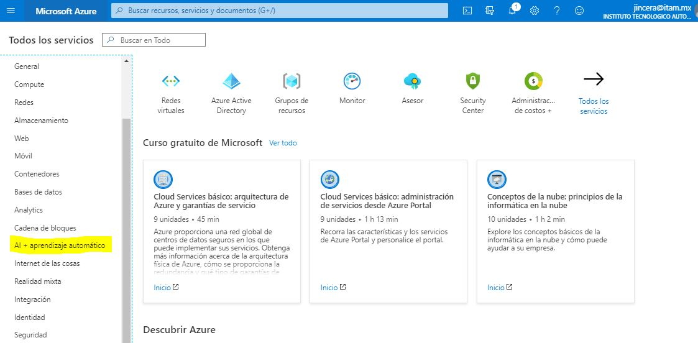
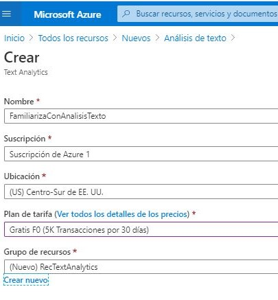
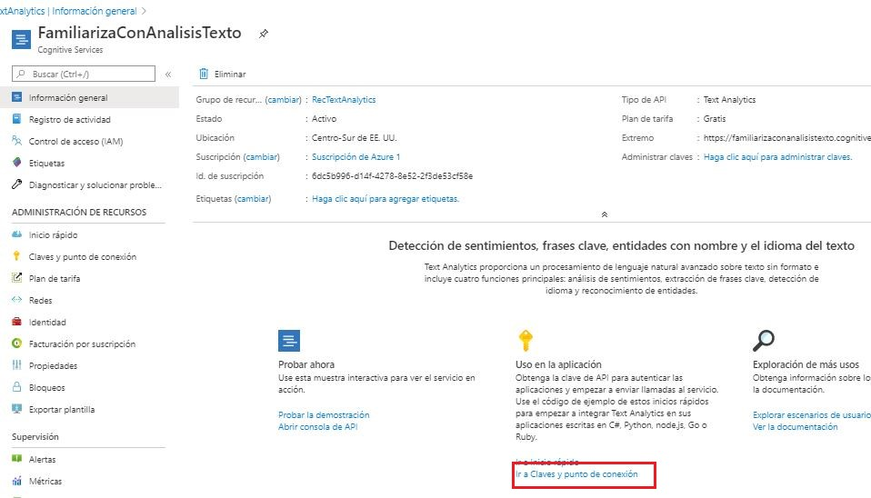
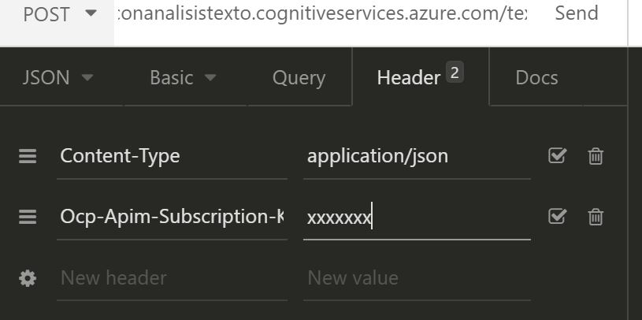

# Fuentes de Información

## Práctica 7: Text Analytics as a Service 

### Introducción

Las técnicas de Inteligencia Artificial (AI) y Aprendizaje Automatizado (ML) están dentro de las tecnologías de mayor impacto en las organizaciones contemporáneas.  Por ello, todas las grandes empresas dedicadas a las Tecnologías de la Información, ofrecen productos y servicios de AI/ML.  

El Análisis de Textos, y con mucho mayor profundidad el Procesamiento de Lenguaje Natural (NLO, *Natural Language Processing*), usan técnicas de Aprendizaje Automatizado, y los avances que ha tenido este campo en los últimos años, son sencillamente espectaculares.

En esta práctica nos familiarizaremos con algunos de los servicios básicos de Análisis de Texto que ofrece Microsoft dentro de su área de servicios cognitivos (*Cognitive Services*).  Estos servicios pueden ser explotados localmente en un contenedor de *docker* o a través de la nube *Azure* de Microsoft.  Se accede a ellos por medio de librerías en distintos lenguajes de programación (Python, C#, Java, etc.) o con métodos HTTP a través de un cliente REST.

Para aprovechar lo aprendido en este curso, explotaremos los servicios de Análisis de Texto en el portal de Microsoft con un cliente REST con nuestra herramienta Insomnia.

Esta práctica está basada en los tutoriales de Microsoft Cognitive Services. Hemos elegido Microsoft Azure por su simplicidad, porque todavía es un servicio gratuito y porque, como miembros de la comunidad ITAM, tenemos acceso a planes más extendidos y muchos otros servicios de Microsoft.  Los fundamentos de lo aquí presentado no son muy distintos si desea trabajar posteriormente en otras plataformas, como IBM Watson, Google NLP o Amazon Comprehensive.

### 1. Objetivos

* Familiarizarnos con algunas operaciones básicas de análisis de texto:
  * Reconocimiento de idiomas
  * Análisis de sentimiento
  * Identificación de frases clave
  * Identificación de entidades
* Explotar servicios en la nube (XaaS), específicamente, en la plataforma Microsoft Azure

### 2. Material

* Una cuenta en [portal.azure.com](portal.azure.com)
* [Insomnia](https://insomnia.rest/),o cualquier cliente REST

### 3. Instrucciones

* La práctica se hace por **POR PAREJAS**.  En esta ocasión, no puede trabajar en equipos de tres o más personas, ni individualmente.
* Tiempo de entrega: Una semana (20 de junio)
* Se entrega un reporte con las capturas de pantalla de los ejercicios y preguntas planteados a lo largo del tutorial

### 4. Desarrollo

#### 4.1. Crear una cuenta en Azure

Para poder acceder a los servicios *Cognitive Services* de Microsoft, debemos tener una cuenta en su portal y crear un *Recurso*.

Desde la página https://azure.microsoft.com/es-es/account/ inicie una sesión o directamente desde el portal de la nube de Microsoft: https://portal.azure.com/

De clic en `Start Free`.  Le pedirá algunos datos pero ninguna cuenta de tarjeta bancaria. **ES CONVENIENTE QUE SE FIRME CON SUS CREDENCIALES DEL ITAM**. 

Una vez en el Portal, encontrará una página como la siguiente. De clic en `AI + aprendizaje automático`.



Ahora seleccione `Análisis de texto ` y cree un nuevo recurso llenando la plantilla que aparecerá. 

* Nombre: Asigne un nombre apropiado. Sólo permite letras, números y el caracter guión bajo '__' 
* Suscripción, Ubicación: Deje los valores por omisión
* Plan de tarifa: Gratis F0
* Grupo de recursos: De clic en `Crear nuevo`

 



No se desespere. La plataforma se toma un poco de tiempo para crear el recurso.

#### 4.2. Obtención de las llaves

Para poder acceder a nuestro nuevo recurso, debemos contar con  un Punto de Interconexión (*endpoint*) y una clave de acceso.  Para ello, de clic en `Ir al recurso`. Encontrará una pantalla como la siguiente. 

Puede navegar, entrar a una interfaz Web para familiarizarse con las funcionalidades del recurso de Análisis de Texto, explorar más información, etcétera.  Para este taller, iremos directamente a `Ir a claves y punto de conexión`:



Debe copiar las dos claves de acceso y el Punto de conexión en un archivo y **Guardarlo en algún lugar seguro, pero que sea fácilmente accesible por usted**. Los utilizaremos más adelante.  Observe que las Claves *no son claves de autenticación*. Es simplemente un identificador para validar el acceso a nuestro recurso.

El siguiente es un ejemplo de un archivo donde hemos guardado esa información:

```
Acceso a punto de conexión Azure:

Clave 1:
xxxxxxxx

Clave 2:
xxxxxxxxxxx

Endpoint:
https://familiarizaconanalisistexto.cognitiveservices.azure.com/

```

---

**EJERCICIO 1.** Cree su propio recurso en *Cognitive Services* y muestre el Punto de Conexión.

---

#### 4.3 Detección del idioma

Es momento de acceder a la primer función ofrecida por la API Text Analytics de Windows Cognitive Services: El reconocimiento del idioma del texto. Esta funcionalidad analiza la información de entrada (hasta 5,120 caracteres) y regresa un identificador del idioma detectado con una puntuación entre 0 y 1 que refleja el nivel de confianza del modelo utilizado, donde 1 significa certeza absoluta.

Para acceder a la funcionalidad a través de nuestro cliente REST, estructuraremos la consulta en Insomnia con un **Método POST** de la siguiente manera.

**A)  URL**. El URL será el de nuestro punto de conexión (*endpoint*) al que se le agrega la extensión `/text/analytics/v3.0/languages para acceder a este servicio en particular.  Por ejemplo:

```http
https://familiarizaconanalisistexto.cognitiveservices.azure.com/text/analytics/v3.0/languages
```

**B) Encabezados**.  Se debe agregar en el encabezado que el contenido del cuerpo del mensaje es JSON, así como la clave de acceso.  Puede utilizar cualquiera de las dos claves que descargó del recurso.   En Insomnia, la configuración de los encabezados se hace así:



Por supuesto, debe sustituir el valor "xxxx" por una de sus claves.

**C) Cuerpo**. Se pueden colocar hasta 1000 identificadores en una estructura JSON, pero el tamaño máximo de la consulta no debe rebasar los 5,120 caracteres. Un ejemplo de una consulta es:

```json
{
    "documents": [
        {"id": "1", "text": "This is a document written in English."},
    {"id": "2", "text": "Este es un document escrito en Español."},
    {"id": "3", "text": "Voici un document en francais"},
	{"id": "4", "text":"Dies ist ein Dokument in deutscher Sprache"}
    ]
}
```


Al mandar la consulta, Azure nos devuelve:

```json
{
  "documents": [
    {
      "id": "1",
      "detectedLanguage": {
        "name": "English",
        "iso6391Name": "en",
        "confidenceScore": 1.0
      },
      "warnings": []
    },
    {
      "id": "2",
      "detectedLanguage": {
        "name": "Spanish",
        "iso6391Name": "es",
        "confidenceScore": 1.0
      },
      "warnings": []
    },
    {
      "id": "3",
      "detectedLanguage": {
        "name": "French",
        "iso6391Name": "fr",
        "confidenceScore": 1.0
      },
      "warnings": []
    },
    {
      "id": "4",
      "detectedLanguage": {
        "name": "German",
        "iso6391Name": "de",
        "confidenceScore": 1.0
      },
      "warnings": []
    }
  ],
  "errors": [],
  "modelVersion": "2019-10-01"
}
```

---

**EJERCICIO 2.**  ¿Qué sucede cuando en un documento hay varios idiomas? Pruébelo con la siguiente frase:  "Voici un document que es una mezcla de idiomas.  We have English, French and Spanish. Let us see the behavior. In general, se escogerá la langue la plus utilisée"

---


---

**EJERCICIO 3.** ¿Este servicio reconoce el Maya y el Nahuatl?  Puede probarlo con las siguientes frases:

* Náhuatl: " "Momiu yezcuepontiu, in mitl cuiea' yeztli' aman xquita' quen yezuetzi' maca xcauili' mayezuetzi', tlamo yeztlamiz pampa yehua' ica yeztli nemi' uan un yeztli' monemiliz."
* Maya: "Koonex koonex, palexen Xik tu bin, xik tu bin, yokol k'in"

¿Qué conclusiones puede sacar de los resultados obtenidos?

---


#### 4.4 Análisis de sentimiento

El Análisis de sentimiento es una de las aplicaciones de Analítica de Textos más populares en la actualidad.  A través de la identificación de adjetivos y del contexto de una oración utilizando técnicas de NLP, se busca tratar de evaluar si la frase tiene una connotación positiva, negativa o neutra.  Como puede imaginar, esta funcionalidad resulta sumamente útil al evaluar de manera automática comentarios en redes sociales, opiniones en foros de discusión, en revisiones de productos, etc.

La funcionalidad de Cognitive Services que estamos utilizando, nos devolverá una calificación (positivo, neutro, negativo o mixto) para todo el documento con un nivel de confianza entre 0 y 1, así como para cada una de las oraciones que conforman el documento.


Para acceder a esta funcionalidad, los encabezados son igulaes y el URL cambia ligeramente porque el punto de conexión del recurso es `/sentiment` en vez `/languages`.  En el cuerpo del método se especifica el idioma y las frases del documento. Por ejemplo:

```json
{
   "documents": [
    {"id": "1", "language": "es",
        "text": "¡Tuve una gran experiencia! Las habitaciones eran amplias, limpias y el personal muy amable."},
    {"id": "2", "language": "en",
        "text": "It is difficult to rate this hotel. The drinks were great, but the food was awful. The staff was rude. The sports facilities, were world class. The sunsests are beatiful, although the weather was a bit too hot for me."},
    {"id": "3", "language": "fr",
        "text": " Chenonceau c'est l'un des plus beaux châteaux sur La Loire."}
]}
```

La respuesta a esta consulta es:

```json
{
  "documents": [
    {
      "id": "1",
      "sentiment": "positive",
      "confidenceScores": {
        "positive": 0.82,
        "neutral": 0.13,
        "negative": 0.05
      },
      "sentences": [
        {
          "sentiment": "positive",
          "confidenceScores": {
            "positive": 0.83,
            "neutral": 0.12,
            "negative": 0.05
          },
          "offset": 0,
          "length": 27,
          "text": "¡Tuve una gran experiencia!"
        },
        {
          "sentiment": "positive",
          "confidenceScores": {
            "positive": 0.81,
            "neutral": 0.13,
            "negative": 0.06
          },
          "offset": 28,
          "length": 64,
          "text": "Las habitaciones eran amplias, limpias y el personal muy amable."
        }
      ],
      "warnings": []
    },
    {
      "id": "2",
      "sentiment": "mixed",
      "confidenceScores": {
        "positive": 0.25,
        "neutral": 0.04,
        "negative": 0.71
      },
      "sentences": [
        {
          "sentiment": "negative",
          "confidenceScores": {
            "positive": 0.0,
            "neutral": 0.0,
            "negative": 1.0
          },
          "offset": 0,
          "length": 35,
          "text": "It is difficult to rate this hotel."
        },
        {
          "sentiment": "negative",
          "confidenceScores": {
            "positive": 0.0,
            "neutral": 0.0,
            "negative": 1.0
          },
          "offset": 36,
          "length": 46,
          "text": "The drinks were great, but the food was awful."
        },
        {
          "sentiment": "negative",
          "confidenceScores": {
            "positive": 0.0,
            "neutral": 0.0,
            "negative": 1.0
          },
          "offset": 83,
          "length": 19,
          "text": "The staff was rude."
        },
        {
          "sentiment": "positive",
          "confidenceScores": {
            "positive": 0.78,
            "neutral": 0.21,
            "negative": 0.01
          },
          "offset": 103,
          "length": 40,
          "text": "The sports facilities, were world class."
        },
        {
          "sentiment": "negative",
          "confidenceScores": {
            "positive": 0.45,
            "neutral": 0.0,
            "negative": 0.55
          },
          "offset": 144,
          "length": 73,
          "text": "The sunsests are beatiful, although the weather was a bit too hot for me."
        }
      ],
      "warnings": []
    },
    {
      "id": "3",
      "sentiment": "positive",
      "confidenceScores": {
        "positive": 0.92,
        "neutral": 0.08,
        "negative": 0.0
      },
      "sentences": [
        {
          "sentiment": "positive",
          "confidenceScores": {
            "positive": 0.92,
            "neutral": 0.08,
            "negative": 0.0
          },
          "offset": 0,
          "length": 60,
          "text": " Chenonceau c'est l'un des plus beaux châteaux sur La Loire."
        }
      ],
      "warnings": []
    }
  ],
  "errors": [],
  "modelVersion": "2020-04-01"
}
```

---

**EJERCICIO 4.** Analice los resultados arrojados por a consulta anterior

___

Como habrá observado, sobre todo en el segundo documento, si bien el análisis de textos ha avanzado mucho en los últimos años, los resulatdos de los modelos deben tomarse con mucha cautela, aún cuando el índice de confianza es alto.  Las sutilezas del idioma y la falta de un contexto amplio para poder hacer un análisis semántico adecuado tienden a generar resultados confusos.


___

**EJERCICIO 5**. Envíe la siguiente frase a su Recurso y comente el resultado:

*Tomar clases a distancia tiene sus pros y sus contras. No haber suspendido las clases durante la pandemia, estuvo bien.  Tampoco extraño para nada el tráfico para llegar a Sta. Teresa.  En cambio, me falta el contacto cara a cara con mis compañeros.*

___


___

**EJERCICIO 6.**  Ahora le toca a usted.  Haga algunas consultas.  Procure tener documentos que califiquen como positivos, negativos y neutros.  

Explore qué ocurre en un párrafo donde claramente hay una frase sarcástica, una pregunta retórica o una descripción sumamente técnica o bien, coloquial.   

Por ejemplo, explore esta sentencia: "Agua corre por mi casa, por mi catre y mi colchón. Esto no es adivinanza; es la gran inundación" -quite y ponga el "no".

No muestre todo el JSON del resultado, solamente las calificaciones y  comente sobre ellas.

---


#### 4.5 Extracción de frases clave

Esta funcionalidad pretende ayudar a identificar rápidamente los "puntos más importantes" del documento. En términos generales, el analizador busca y descarta las palabras que no son esenciales y conserva solo los términos o frases que parecen ser el asunto o el objeto de una frase. Esta funcionalidad ayudaría, por ejemplo, para alimentar la matriz de términos/documentos.

El servicio funciona mejor con textos relativamente grandes; sin embargo, para fines de este tutorial seguiremos trabajando con frases y párrafos relativamente pequeños. 

El URL para esta funcionalidad es `/keyPhrases y los encabezados, como podrá imaginar, son los mismos.  Al igual que en el análisis de sentimientos, en el cuerpo del documento se agrega un identificar para cada documento, el idioma en el que está escrito, y el texto:

```json
{
    "documents": [
            {
                "language": "es",
                "id": "1",
                "text": "Nos encanta esta ruta y la recorremos cada año.  Las vistas son espectaculares y bien vale la pena el esfuerzo."
            },
            {
                "language": "es",
                "id": "2",
                "text": "El sendero está muy mal señalado. Varias veces nos sentimos perdidos. La peor caminanta de mi vida."
            },
            {
                "language": "en",
                "id": "3",
                "text": "Everyone in my family liked the trail but thought it was too challenging for the less athletic among us. Not necessarily recommended for small children."
            },
            {
                "language": "fr",
                "id": "4",
                "text": "Il était brumeux, donc nous avons raté quelques vues spectaculaires, mais le sentier était correct. Ca vaut la peine de vérifier si vous êtes dans le coin."
            },
            {
                "language": "es",
                "id": "5",
                "text": "Esta es mi ruta favorita.  Vistas maravillosas y varios lugares para descansar."
            }
        ]
}
```

El resultado es el siguiente:

```json
{
  "documents": [
    {
      "id": "1",
      "keyPhrases": [
        "pena",
        "vistas",
        "esfuerzo",
        "ruta"
      ],
      "warnings": []
    },
    {
      "id": "2",
      "keyPhrases": [
        "vida",
        "peor caminanta",
        "sendero",
        "veces"
      ],
      "warnings": []
    },
    {
      "id": "3",
      "keyPhrases": [
        "trail",
        "small children",
        "family"
      ],
      "warnings": []
    },
    {
      "id": "4",
      "keyPhrases": [
        "sentier",
        "vues spectaculaires",
        "peine",
        "coin"
      ],
      "warnings": []
    },
    {
      "id": "5",
      "keyPhrases": [
        "ruta favorita",
        "lugares"
      ],
      "warnings": []
    }
  ],
  "errors": [],
  "modelVersion": "2019-10-01"
}
```


---

**EJERCICIO 7.** Veamos qué considera este módulo como relevante en el promocional de la MTIA.   Lance una consulta con los siguientes párrafos (un párrafo por documento) e indique cuántas frases distintas encontró en todo el documento.   


> En este entorno de gran dinamismo, las organizaciones exitosas son aquellas que modifican su percepción de las TIC como simples proveedoras de servicios de soporte y buscan posicionarlas como un habilitador para la creación de nuevos productos y servicios, que contribuyan a la sustentabilidad de la organización.


> La Maestría en Tecnologías de Información y Administración (MTIA) del ITAM forma profesionales de alto impacto capaces de integrar las TIC con los procesos de negocio, alineadas a la estrategia de la organización. Son líderes transversales que comprenden el entorno en el que la empresa se desenvuelve y detectan las oportunidades que las TIC ofrecen para elevar la competitividad de sus organizaciones.


> El profesionista egresado de este programa está facultado para: Solucionar los problemas de negocio de las organizaciones a través del uso eficiente de las tecnologías de información y de comunicaciones; identificar oportunidades para agregar valor a la estrategia de negocio a través de las TCI; establecer un liderazgo activo en el proceso  de toma de decisiones y de gestión del cambio inducido por las TIC en la organización; analizar las implicaciones económicas, políticas, legales y éticas relacionadas con la puesta en operación y uso de las TIC; contribuir, a través de su desempeño profesional, a la formación de una sociedad más próspera, más libre y más justa.


> El plan de estudios de la MTIA está dirigido a profesionales que buscan un posgrado de alta calidad sin tener que suspender su desarrollo profesional. Las materias del programa se ofrecen en un horario de 19:00 a 22:00 en periodos trimestrales. El alumno asiste a clases una vez por semana por cada materia que haya inscrito en el trimestre


Comente brevemente sobre el resultado obtenido: ¿Cuáles palabras clave sí parecen tener sentido y cuáles no, si usted estuviera utilizando este sistema para clasificar/descartar documentos relacionados con estudios de posgrado en TI?

___


---

**EJERCICIO 8.**  Busque un pequeño reportaje que hable sobre el impacto de las nuevas tecnologías exponenciales en el trabajo ("La cuarta revolución industrial") -en inglés o en español-, seleccione tres o cuatro párrafos que le parezcan relevantes, lance la consulta y analice los resultados

---


#### 4.6 Identificación de identidades

Esta es una funcionalidad interesante del Servicio Text Analytics para *enriquecer* la información disponible en un documento.  Busca identificar y clasificar entidades como *personas, lugares, organizaciones, fechas, cantidades, divisas*, entre otros. Para aquellas entidades que son bien conocidas, las vincula con información disponible en la Web, específicamente, con Wikipedia.

Si solamente desea identificar entidades, el *endpoint* es `/entities/recognition/general`.  Si lo que desea es ligar las entidades conocidas con información adicional, es `/entities/linking`.

Como de costumbre, el cuerpo del documento especifica el idioma, un identificador de documento y el texto a analizar:


```json
{
    "documents": [
            {
                "language": "es",
                "id": "1",
                "text": "El plan de estudios de la Maestría en Tecnologías de Información y Administración del ITAM está dirigido a profesionales que buscan un posgrado de alta calidad  sin tener que suspender su desarrollo profesional.  Las materias del programa se ofrecen en un horario de 19:00 a 22:00 en periodos trimestrales.  El alumno asiste a clases una vez por semana por cada materia que haya inscrito en el trimestre."
            },
            {
                "language": "es",
                "id": "2",
                "text": "Desde hace 20 años mantenemos convenios de doble grado académico con dos instituciones asociadas al prestigioso Institut Mines-Telecom de Francia.  El convenio tiene un costo de 7500 Euros"
            },
            {
                "language": "es",
                "id": "3",
                "text": "A partir de 2013 mantenemos un convenio de colaboración con Stevens Institute of Technology en Nueva Jersey, a través del cual los alumnos pueden optar por alguno de tres grados académicos"
            },
            {
                "language": "es",
                "id": "4",
                "text": ": En el caso de los aspirantes extranjeros y/o residentes fuera del país, se podrá presentar el examen GMAT (aplicado por la Embajada Norteamericana), y se deberán enviar los resultados del mismo junto con la documentación y giro correspondiente."
            }
        ]
    }
```

---

**EJERCICIO 9.**  Lance las dos consultas (reconocimiento de entidades  y ligado de entidades conocidas) sobre el texto anterior y comente brevemente sobre los resultados obtenidos.

---


---

**EJERCICIO 10**  ¿Cómo podría incorporar el servicio de Text Analytics que revisamos en este tutorial **para automatizar** la ingesta, consulta y síntesis de documentos (páginas Web, micro blogs en Twitter, análisis de correos electrónicos, ...)

---


