# Fuentes de Información

## Práctica 8: Análisis de textos con VisualText

En este tutorial seguiremos un proceso metódico para extraer información de textos no estructurados, pero con un formato razonablemente regular; una situación relativamente común en los documentos de una organización.

Trabajaremos con la herramienta **VisualText** [http://www.textanalysis.com/](http://www.textanalysis.com/). De hecho, el tutorial está inspirado en el analizador de muestra contenido en  su documentación.


### 1. Objetivos

+  Familiarizarnos con algunos de los conceptos básicos relacionados con el análisis de textos
+  Construir una base de conocimiento (KB, *knowledge base*) básica para un dominio específico

### 2. Material

* La herramienta **VisualText** [http://www.textanalysis.com/](http://www.textanalysis.com/), que debe descargar en su computadora **y revisar los cuatro primeros tutoriales antes del inicio de la sesión**

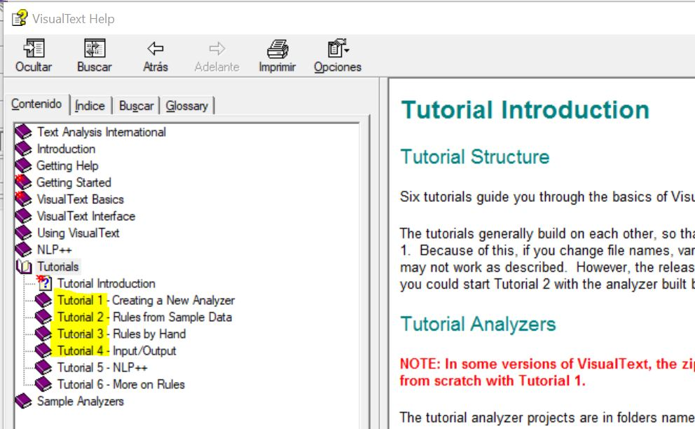

* Algunos documentos con estados de resultados financieros que le serán  proporcionados por el profesor

### 3. Instrucciones

* La práctica se hace POR PAREJAS
* La fecha de entrega es el viernes 26 de junio a las 17:00. Se entrega un reporte que muestre lo siguiente:

+ Segmentos de código y capturas de pantalla con el texto resaltado que demuestre que se responde a los ejercicios planteados en este documento

* Un analizador de textos para reportar las ganancias correspondientes a las unidades de negocio (Software, Servicios Globales, Servidores, etc.) 

* **Puntos extra:** Un analizador de textos para reportar la evolución del valor de las acciones. 

### 4. Desarrollo

#### 4.1 Introducción

Vamos a usar VisualText para extraer información de los reportes de resultados de una corporación (IBM). Los reportes de resultados datan de una época en que la corporación tenía *tres regiones* (América, Asia-Pacífico y Europa, Oriente Medio y Afríca -EMEA) y *cuatro o cinco unidades de negocio* (Software, Servicios Globales, Servidores, etc.).

El análizador que se desarrollará es muy básico y limitado; sólo toma en cuenta aspectos generales para **extracción de información** de texto plano, la cual es una de las aplicaciones más populares en el análisis de textos.

Esta práctica asume que ya ha descargado e instalado la herramienta VisualText y que ha revisado los cuatro primeros tutoriales presentados en el menú de ayuda.

#### 4.2 Descarga de datos

Descargue los archivos de reportes de resultados de la carpeta  `EdoResultados` en el sitio github del profesor. Para descargarlos, seleccione el archivo, de clic-derecho en el botón `Raw` arriba, a la derecha y seleccione `Guardar enlace como...`  Guárdelos en el escritorio o en un directorio que le sea familiar.

#### 4.3. Crear nuevo proyecto

Lance el programa `VisualText` y cree un nuevo analizador (`File/New Analyzer`). Nómbrelo GananciasIBM. Para la ubicación, utilice la misma ruta que usó en el tutorial.  En nuestro caso, es `c:\apps\FolderAnalizador`.  Finalmente elija como plantilla `Bare`. El resultado debe quedar así:

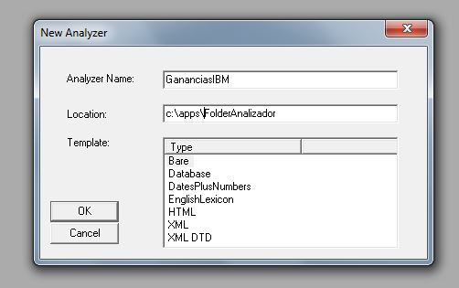

Vamos a cargar el primer archivo con estados de resultados de IBM. 

Posiciónese en la ventana de texto, de clic derecho y seleccione
`Add/Folder` y cree el folder `Reportes4Q`. 

Colóquese en el folder, de clic derecho `Add/Existing Text File`.
Navegue hasta el directorio en el que están los archivos de resultados, seleccione `4Q2006` y `Abrir`:

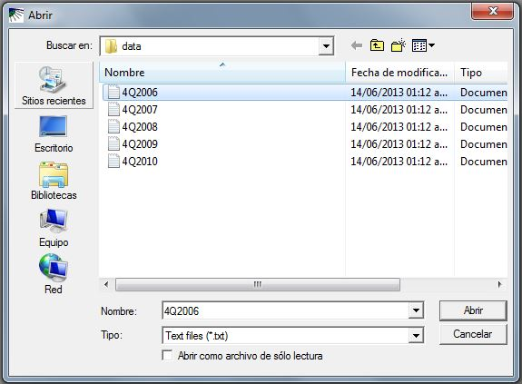

Como lo hizo en el tutorial, ejecute el analizador.  Sólo tenemos las reglas para seperar el archivo en *tokens*; verifique que se hizo revisando el `Parse Tree` (recuerde, clic derecho en el archivo, `View/Parse Tree`).

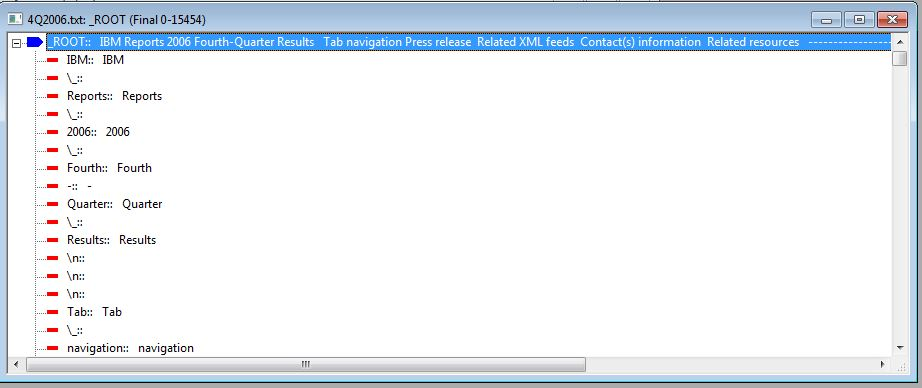

_____________________
**EJERCICIO 1.** ¿Qué es un Token en análisis de textos?

_____________________


A lo largo de la práctica implementaremos un analizador que tiene los siguientes pasos:

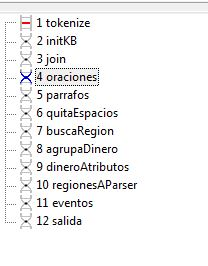

#### 4.4. Inicializa la base de conocimiento

Dado que el analizador va a trabajar con varios textos, debemos asegurar que el área del analizador gramatical (*parsing*) está limpia entre una corrida y otra.  También debemos inicializar las secciones de la KB que se llenan dinámicamente, en nuestro caso, las regiones en que está dividido el corporativo. Si la base no tiene un concepto "corporate", se debe poder crear esa área.

En la pestaña del analizador (Ana) de clic derecho en el paso tokenize y selecciones `Add/New Pass`. Nómbrelo `initKB` y deje el tipo `Pattern`.

Ahí deberá incluir el siguiente código.  Nota: En el lenguaje que utiliza VisualText (NLP++), G es una variable global; L es una local.

```bash
###############################################
# FILE: initKB.pat
# SUBJ: comment here
# AUTH: 
# CREATED: 28/Aug/2017 18:13:17
# MODIFIED:
###############################################

@CODE
	

G("corporate") = findconcept(findroot(),"corporate");

# Si no hay concepto "corporate", debemos agregarlo
if (!G("corporate"))
	G("corporate") = makeconcept(findroot(),"corporate");

G("parse") = findconcept(G("corporate"),"parse");

# Si ya se ha corrido el analizador, hay que borrar las entradas
if (G("parse"))
	rmchildren(G("parse"));
else
	G("parse") = makeconcept(G("corporate"),"parse");
	
G("regiones") = findconcept(G("corporate"),"regiones");
G("section number") = 0;

# Si no existen regiones, agrégalas.
if (G("regions"))
	exitpass();
    
G("regiones") = getconcept(G("corporate"),"regiones");

L("reg") = getconcept(G("regiones"),"Americas");
L("reg") = getconcept(G("regiones"),"AsiaPacific");

@@CODE
```
_____________________
**EJERCICIO 2.** Al código anterior le falta una región. Identifique cuál es y modifique el código para agregarla.

____________________

Corra el analizador y abra el editor de la base `KB Editor`. Es el ícono con forma de árbol de decisión horizontal). Si todo está bien, deberá ver una imagen como la siguiente:

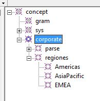

#### 4.5. Join

La primera pasada, tokenize, separa caracteres alfabéticos, numéricos, de puntuación y espacios en blanco, pero en la práctica, quisiéramos tratar algunos de esos tokens como un conjunto.  Por ejemplo, en las unidades de moneda, $3.50 debería ser un solo token.  

Con el paso "join" vamos a redefinir tokens para estos casos. La regla "_dinero" busca tokens que inician con "$", les sigue un número, después un punto y una coma y después un número.  Cuando se encuentra una combinación de ese tipo, se crea un nuevo nodo llamado _dinero.

La acción @POST indica qué hacer cuando se aplica la regla. En este caso, se crea un nodo sugerido con el valor numérico del token correspondiente.

Este código está basado en el ejemplo citado en la referencia y toma en cuenta muchos otros casos que merecen ser *re-tokenizados*.


```bash
@NODES _ROOT
	
@RULES

_num <-
    _xNUM [s]	### (1)
    \. [s]	### (2)
    _xNUM [s]	### (3)
    @@
	
_paragraphSeparator <-
    \n [s min=2 max=0]	### (1)
    @@

@POST
	N("quoted",1) = 1;
	excise(4,4);
	excise(1,1);
	
@RULES
_xNIL <-
    \` [s]	### (1)
    _xALPHA [s] ### (2)
    \. [s trig] ### (3)
    \' [s]	### (4)
    @@		

@POST
    L("tmp") = N("$text",2) + "." + N("$text",4);
	S("value") = flt(L("tmp"));
#	S("value") = num(N("$text",2));
	single();

@RULES		
_dinero <-
    _xWILD [s one matches=(\$ )]	### (1)
    _xNUM [s]	### (2)
    _xWILD [s one matches=( \. \, )] ### (3)
    _xNUM [s] ### (4)
    @@

@POST
	S("value") = num(N("$text"));
	single();
@RULES		
_dinero <-
    _xWILD [s one matches=(\$ )]	### (1)
    _xNUM [s]	### (2)
    @@

@RULES
_abbrev <-
    _xCAP [s]	### (1)
    \. [s]	### (2)
    _xCAP [s]	### (3)
    \. [s]	### (4)
    @@
	
_alphaNum <-
    _xALPHA [s]	### (1)
    _xNUM [s] ### (2)
    @@
	
_numAlpha <-
    _xNUM [s] ### (1)
    _xALPHA [s] ### (2)
    @@

_number <-
    _xNUM [s]	### (1)
    \, [s]	### (2)
    _xNUM [s]	### (3)
    @@

_percent <-
    _xNUM [s] ### (1)
	\% [s]	### (2)
	@@

@POST
	S("number") = N("$text",4);
	single();
@RULES
_rank <-
	No [s]	### (1)
	\. [s]	### (2)
	_xWHITE [s star]	### (3)
    _xNUM [s] ### (4)
	@@
```
Active la opción de resaltar texto (icono con doble 'A') y ejecute el analizador para identificar qué coincidencias hubo.

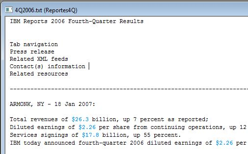

#### 4.6. Oraciones y párrafos

Frecuentemente es útil agrupar los tokens en oraciones y párrafos. De hecho, en esta práctica desplegaremos las oraciones en donde aparece la información de interés.

Los siguientes segmentos de código permiten hacer justamente eso.

```bash
@CODE
# Contador de oraciones. 
G("contador oraciones") = 0;

@NODES _ROOT

@POST
	++G("contador oraciones");	# Lleva la cuenta de las oraciones encontradas.
	S("name") = "oracion" + str(G("contador oraciones"));	
	S("object") = makeconcept(G("parse"),S("name"));	# Se agrega al parse de la KB
	addstrval(S("object"),"text",N("$text",1));
	single();

@RULES
_oracion [unsealed] <-
    _xWILD [s plus fails=(\. \? \! _paragraphSeparator)]	### (1)
    _xWILD [s one matches=(\. \? \!)] ### (2)
    @@

_oracion [unsealed] <-
    _xWILD [s plus fails=(_paragraphSeparator)]	### (1)
    @@
```

Compile y observe el "parse tree" (ícono con arborescencia hacia abajo) para comprobar que está agrupando el texto en oraciones:

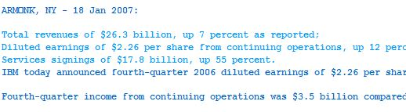

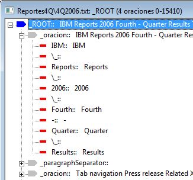

Ahora agrupemos por párrafos.  Será muy sencillo porque la pasada anterior ya hemos identificado qué es una oración:

```bash
@NODES _ROOT

@RULES
_parrafo [unsealed] <-
    _oracion [s plus]	### (1)
    _xWILD [s matches=(_paragraphSeparator _xEND)] ### (2)
    @@
```

#### 4.7. Espacios en blanco

Al implementar un analizador de textos, es muy común eliminar espacios en blanco entre tokens para simplificar las reglas al tratar de identificar patrones. 

En el siguiente código, la sentencia @PATH indica a quén nivel se aplicarán las reglas de coincidencia.  En este caso, se está indicando que se inicie en la raíz del árbol de análisis gramatical (`_ROOT`), encuentre un hijo llamado _parrafo y después uno llamado _oracion.  Sólo entonces se tratará de buscar un patrón que coincida con las reglas indicadas.


```bash
@PATH _ROOT _parrafo _oracion

@POST
	excise(1,1)
@RULES
_xNIL <-
    _xWHITE [s] ### 1
	@@
```

#### 4.8. Busca region

Veamos cómo usar la base de conocimiento como un diccionario.

En el siguiente códgio, el área de @RULES indica buscar frases de longitud 1 a 3 simplemente colocando tres reglas.  Esto es útil, por ejemplo, si las regiones tuvieran nombres compuestos.

En el área @CHECK se especifica si se acepta o rechaza una coincidencia con base en un criterio determinado.  El objetivo es buscar coincidencias de las regiones en la KB.

Se busca una frase con la función `phrasetext()` y el resultado se asigna a la variable `frase`. Esta la buscamos en el concepto regiones de la KB con la función `findconcept()`. Si no hay coincidencia, se rechaza la regla.

```bash
@PATH _ROOT _parrafo _oracion

@CHECK
	S("frase") = phrasetext();

	"buscaRegion.txt" << "Intento con: " << S("frase") << "\n";
	S("object") = findhierconcept(S("frase"),G("regiones"));
	if (!S("object"))
		fail();

@POST
	S("normal") = conceptname(S("object"));
	"buscaRegion.txt" << "\tEncontré: " << S("normal") << "\n";
	single();

@RULES
_region <-
    _xALPHA [s]	### (1)
    _xALPHA [s]	### (2)
    _xALPHA [s]	### (3)
    @@
	
_region <-
    _xALPHA [s]	### (1)
    _xALPHA [s]	### (2)
    @@
	
_region <-
    _xALPHA [s] ### (1)
    @@
```
En el código anterior se muestra cómo se puede almacenar información auxiliar para depurar el programa.  Se escriben en el archivo `buscaRegion.txt` las frases recuperadas por este paso, y eventualmente, la coincidencia encontrada en la KB.

El archivo está en la ventana `text` abajo del archivo que se está analizando.  Si lo abre, encontrará un resultado como el siguiente:

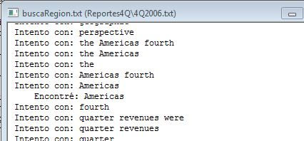

Por supuesto, en el texto quedan resaltadas las regiones encontradas.

_____________________
**EJERCICIO 4.** Haga una captura de pantalla demostrando que puede resaltar las tres regiones.

____________________

#### 4.9. Frases sobre ganancias (dinero)

Al revisar el reporte de resultados, vemos que las ganancias están expresadas en **billones** de dólares. Conviene agrupar las frases relacionadas con la ganancia.

De paso, almacenaremos el valor numérico por si en un futuro se desean hacer cálculos con él.

En el @POST, `N("value",1)` significa que se toma el campo "value" del nodo que coincide con el primer elemento ("1") de la regla, en nuestro caso, el concepto _dinero que se ha creado antes.  Por eso es buena práctica separar y enumerar cada componente de una regla.

```bash
@PATH _ROOT _parrafo _oracion

@POST
	S("value") = N("value",1)*1000000000;
	single();
@RULES
_dinero <-
	_dinero [s]  ###(1)
	billion [s]  ###(2)
	dollars [s optional]  ###(3)
	@@

@POST
	S("value") = num(N("$text",1))*1000000000;
	single();
@RULES
_dinero <-
	_xNUM [s]  ###(1)
	billion [s]  ###(2)
	@@
```

Ahora queremos vincular esas frases con "revenue" y las palabras alrededor de ellas, es decir, sus *atributos*.  Revisando el reporte, encontramos frases como *Total revenues of ..., Revenues from EMEA were ...*.  Trataremos de capturarlos con el siguiente código. 

NOTA. Algunos quedarán fuera; un analizador se va afinando poco a poco conforme se incluyen más ejemplos.  Por ejemplo, si agrupamos incluyendo la región, quizás más adelante nuestro analizador no será capaz de identificar regiones en una oración.

```bash
@PATH _ROOT _parrafo _oracion

@POST
	S("value") = N("value",4);
	single();

@RULES
_dinero <-
	Total [s]  ### (1)
	revenues [s] ### (2)
	of [s] ### (3)
	_dinero ### (4)
	@@
	
_dinero <-
	Total [s]  ### (1)
	revenue [s] ### (2)
	of [s] ### (3)
	_dinero ### (4)
	@@
	
_dinero <-
	fourth\-quarter [s]  ### (1)
	revenues [s] ### (2)
	were [s] ### (3)
	_dinero ### (4)
	@@

```


##### Tree of selected

Para fines de depuración, VisualText ofrece una funcionalidad muy útil: *Tree of selected*.  Posiciónese en un paso del analizador que quiera evaluar, seleccione una sección del texto y de clic-derecho Tree of Selected.  En esta figura se muestra el resultado para nuestra última pasada, en la región correspondiente a las Américas:

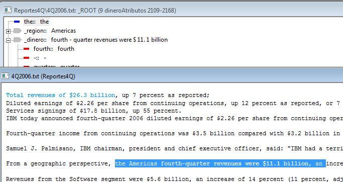


#### 4.10. Regiones al analizador gramatical

Este es un paso muy importante para la funcionalidad de **extracción de información** que estamos implementando.  El siguiente código encontrará las regiones de interés y se actualizará el *árbol de análisis gramatical* en la base de conocimiento.  Específicamente, en cada oración en que se encuentre una coincidencia, el árbol creará ramas con la información correspondiente.

```bash
@PATH _ROOT _parrafo _oracion

@POST
	if (!N("normal"))
		N("normal") = N("$text");
	N("object") = makeconcept(X("object"),N("$text"));
	addstrval(N("object"),"type","region");
	addstrval(N("object"),"normal",N("normal"));
	
@RULES
_xNIL <-
	_region [s]	### (1)
	@@
```

Ejecute el analizador y abra el editor de KB. Deberá encontrar algo similar a esta imagen:

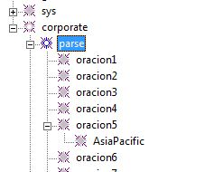

#### 4.11. Salida

Finalmente, el siguiente segmento de código reporta la frase en la que se mencionan ganancias para alguna de las regiones de interés.  

Por supuesto, con un analizador más preciso, se podría identificar, por ejemplo la fecha o trimestre reportado, la región de interés y el monto de la ganancia, y entregar únicamente esos datos como salida para integrarlos a una plataforma de análisis de información estructurada.

```bash
@CODE
"saleAnalisis.txt" << "[" << today() << "]" << "\n";

G("oracion") = down(G("parse"));

while (G("oracion"))
	{
	G("object") = down(G("oracion"));
	
	while (G("object"))
		{
		if (strval(G("object"),"type") == "region")
			{ 	
				"saleAnalisis.txt" << "-------------------------------------------------------------\n";
				"saleAnalisis.txt" << "Frase:  \"" << strwrap(strval(G("oracion"),"text"),60) << "\"\n\n";
			   	"saleAnalisis.txt" << "Región: " << conceptname(G("object")) << "\n";
			 }
					
		G("object") = next(G("object"));
		}
	G("oracion") = next(G("oracion"));
	}
@@CODE

```

Al ejecutar el analizador podrá encontrar debajo del archivo de texto, el archivo "saleAnalisis.txt".  Al abrirlo, encontrará un reporte similar al siguiente:

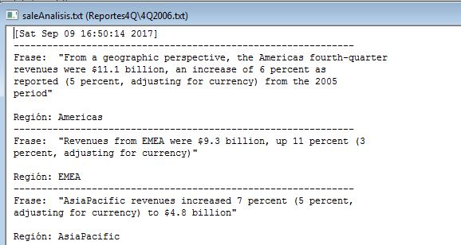

_____________________
**EJERCICIO 5.**  Agregue los demás archivos con los reportes de resultados a la carpeta *Reportes4Q*, posiciónese en la carpeta y lance el analizador. Reporte las ganancias del último trimestre para cada región y para cada año

____________________


